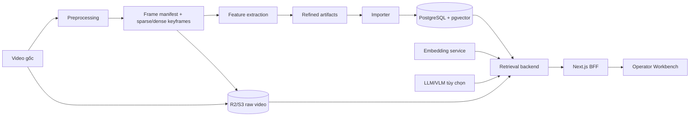

# AIC 2026 — Tìm kiếm video đa phương thức

Đây là codebase cho hệ thống tìm kiếm và duyệt bằng chứng video của AIC 2026.
Hệ thống đi từ video gốc, tạo frame có định danh chính xác và các feature đa
phương thức, nạp chúng vào bộ máy retrieval, sau đó cung cấp Workbench để
người vận hành chọn frame và tạo submission preview.

## Phạm vi hiện tại

Các phần chính đã có trong repository:

- preprocessing hai tầng: sparse retrieval frames và dense exact-frame
  alignment;
- feature extraction cho caption, OCR tiếng Việt, object detection, visual
  embedding và ASR theo timeline;
- contract JSON Schema dùng chung giữa pipeline, ingestion và backend;
- NestJS retrieval backend với PostgreSQL/pgvector, full-text search, RRF
  fusion, R2 signed URL và các chế độ degraded khi dependency chưa sẵn sàng;
- Next.js Workbench theo hướng frame-first cho `textual_kis`, VQA và TRAKE;
- lựa chọn thủ công, submission preview JSON/CSV và xuất CSV các frame lân cận
  quanh một frame tâm do người dùng chọn (1–50 frame, gồm frame tâm).

Backend hiện tạo preview để kiểm tra; adapter submit chính thức lên hệ thống
cuộc thi nằm ngoài phạm vi repository này. Một số retrieval branch/model là
tùy chọn và sẽ được báo là `unavailable` nếu chưa cấu hình artifact hoặc service
tương ứng.

## Kiến trúc



`original_frame_id` là định danh source-frame chuẩn, bắt đầu từ `0`. Timestamp
chỉ là thông tin phụ trợ; không được suy ngược timestamp thành frame khi đã có
`original_frame_id`.

## Chạy nhanh trên máy local

### Yêu cầu

- Docker Desktop đang chạy;
- Node.js `>=20`;
- Python `3.11+`;
- `ffmpeg` và `ffprobe` trong `PATH` cho probing, ASR và exact-frame decode;
- `npm` cho backend, Corepack/pnpm cho frontend.

### Khởi động database và embedding service

Từ thư mục repository:

```powershell
Copy-Item apps/backend/.env.example apps/backend/.env
docker compose up -d --build postgres embedding
```

Mở `apps/backend/.env` và cấu hình ít nhất `DATABASE_URL`,
`DATABASE_DIRECT_URL` trỏ tới PostgreSQL local ở port `5433`, cùng
`EMBEDDING_SERVICE_URL=http://127.0.0.1:8001/embed` nếu muốn dùng CLIP branch.
Không đưa R2/API key thật vào git hoặc vào frontend.

### Migration và backend

```powershell
Set-Location apps/backend
npm install
npm run db:migrate
npm run db:verify
npm run start:dev
```

### Frontend

Mở terminal khác:

```powershell
Set-Location apps/frontend
corepack enable
pnpm install
pnpm dev
```

Mở <http://localhost:3000>. Nếu `BACKEND_API_URL` để trống, frontend dùng
fixture deterministic cho search; các thao tác cần backend sẽ trả lỗi rõ ràng
thay vì ghi dữ liệu giả. Hướng dẫn đầy đủ nằm ở
[`apps/frontend/README.md`](apps/frontend/README.md).

### Import feature vào database

Sau khi đã có refined artifacts, chạy dry-run trước rồi mới import:

```powershell
python -m pip install -r pipelines/ingestion/requirements.txt
$env:PYTHONPATH = (Get-Location).Path
python -m pipelines.ingestion.import_refined `
  --data-root D:\data\refined `
  --dry-run
```

Khi validation thành công, bỏ `--dry-run`, truyền database URL và chạy lại
`npm run db:build-indexes`, `npm run db:verify` trong `apps/backend`. Chi tiết
layout artifact và các phase import nằm ở
[`pipelines/ingestion/README.md`](pipelines/ingestion/README.md).

### Chạy toàn bộ stack bằng Docker

Sau khi đã chuẩn bị `apps/backend/.env` và migration, có thể chạy:

```powershell
docker compose up -d --build
```

Các cổng mặc định là frontend `3000`, backend `4000`, embedding `8001` và
PostgreSQL `5433`. Compose này dành cho local; đổi credentials và giới hạn
network trước khi dùng ngoài máy phát triển.

## Các lệnh thường dùng

| Scope | Lệnh | Mục đích |
|---|---|---|
| Backend | `npm run start:dev` | Chạy NestJS với watch mode |
| Backend | `npm run db:migrate` | Áp dụng migration |
| Backend | `npm run db:build-indexes` | Tạo FTS/trigram/HNSW sau khi import |
| Backend | `npm run db:verify` | Kiểm tra schema, index và release |
| Backend | `npm test` / `npm run test:coverage` | Unit/integration test và coverage |
| Backend | `npm run typecheck` / `npm run build` | Kiểm tra TypeScript và build |
| Frontend | `pnpm dev` | Chạy Next.js dev server |
| Frontend | `pnpm test` / `pnpm test:coverage` | Component, route và utility tests |
| Frontend | `pnpm test:e2e` | Playwright qualification flow |
| Frontend | `pnpm typecheck` / `pnpm lint` / `pnpm build` | Kiểm tra frontend |
| Pipelines | `python -m unittest discover -s tests -q` | Test pipeline và contract |
| Preprocessing | `python -m pipelines.preprocessing.cli --help` | Xem các stage offline |
| Greenfield pipeline | `python -m pipelines.main --help` | Xem DAG local/hybrid/Modal |

Chạy các lệnh Node trong đúng thư mục con tương ứng; repository không có
root `package.json`.

## Bản đồ repository

| Thư mục | Vai trò |
|---|---|
| `apps/frontend/` | Next.js Workbench và BFF routes |
| `apps/backend/` | NestJS retrieval API, database adapter, media và task executor |
| `contracts/` | JSON Schema và semantic validation dùng chung |
| `pipelines/preprocessing/` | Frame manifest, sparse sampling, dense decode, indexing |
| `pipelines/feature_extraction/` | ASR, caption, OCR, object và visual embedding |
| `pipelines/ingestion/` | Validate/import refined artifacts vào PostgreSQL |
| `pipelines/main/` | Greenfield DAG orchestration local/hybrid/Modal |
| `embedding_services/` | FastAPI CLIPA text/image embedding service |
| `docs/` | PRD, design, testing notes và runbook triển khai |
| `data/`, `artifacts/`, `outputs/` | Khung lưu dữ liệu local; phần lớn output bị gitignore |
| `eval/`, `experiments/` | Khu vực đánh giá và thử nghiệm |

Raw video, model weights, `.env`, parquet/numpy output và local cache không
thuộc source control. Xem `.gitignore` trước khi chia sẻ hoặc staging artifact.

## README theo module

- [Frontend Workbench](apps/frontend/README.md)
- [Backend retrieval API](apps/backend/README.md)
- [Contract boundary](contracts/README.md)
- [Video preprocessing](pipelines/preprocessing/README.md)
- [Refined database ingestion](pipelines/ingestion/README.md)
- [Greenfield pipeline](pipelines/main/README.md)
- [ASR](pipelines/feature_extraction/asr/README.md)
- [Image captioning](pipelines/feature_extraction/captioning/README.md)
- [Vietnamese OCR](pipelines/feature_extraction/ocr/README.md)
- [Object detection](pipelines/feature_extraction/object_detection/README.md)
- [Unified feature extraction](pipelines/feature_extraction/unified/README.md)
- [Visual embedding](pipelines/feature_extraction/visual_embedding/README.md)
- [Query embedding service](embedding_services/README.md)

## Tài liệu vận hành liên quan

- [Local Docker runbook](RUNBOOK_LOCAL_DOCKER.md)
- [GitHub → Kaggle → R2 keyframe runbook](docs/keyframe_kaggle_r2_runbook.md)
- [VLM team guide](HUONG_DAN_VLM_TEAM.md)
- [Contract compatibility policy](contracts/versioning/compatibility_policy.md)
- [Testing/design notes](docs/testing/)

Khi thay đổi schema, identity hoặc output artifact, cập nhật contract và README
module liên quan trong cùng một thay đổi; không dùng README làm source of truth
cho dữ liệu máy đọc được.
