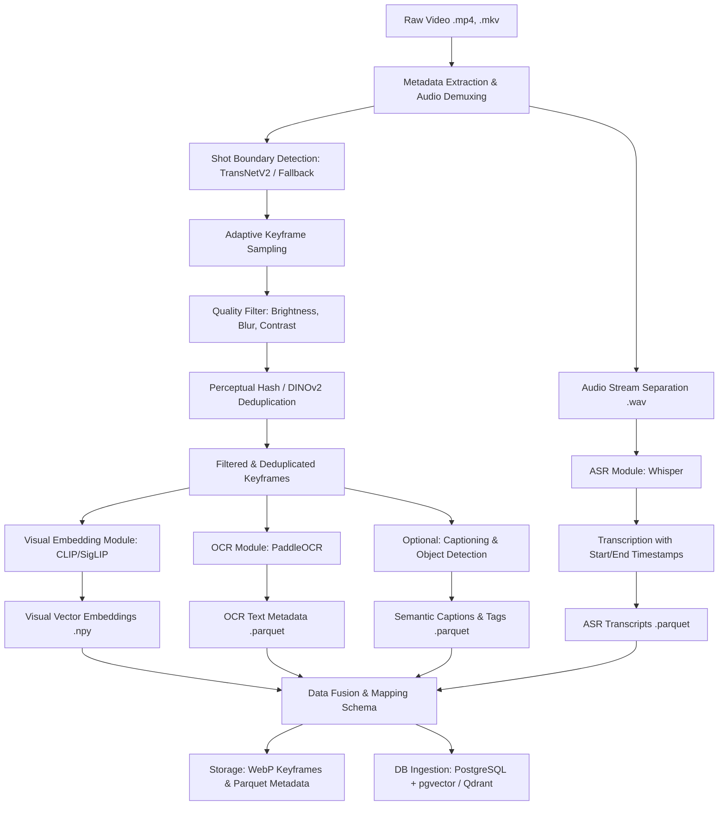

# Ho Chi Minh City AI Challenge 2026: Multimedia Preprocessing Pipeline

## Overview
This repository serves as the official, primary codebase for the Ho Chi Minh City AI Challenge 2026. It encapsulates the comprehensive Multimedia Preprocessing Pipeline and the advanced Retrieval System designed to tackle complex, large-scale video and segment search tasks using Natural Language Queries (NLQ).

## Directory Structure
The source code within this repository is organized systematically to promote modularity and scalability:

- **`apps/`**: Contains the core application modules, user interfaces, and primary online service APIs.
- **`artifacts/`**: Serves as the storage directory for intermediate outputs, pre-trained model weights, and compiled build artifacts.
- **`configs/`**: Houses all system configuration files (YAML/JSON), encompassing hyper-parameters for both the data processing pipelines and the deep learning models.
- **`contracts/`**: Defines the data schemas and API contracts essential for ensuring seamless integration and data consistency across various system modules.
- **`data/`**: Designated for raw video ingestion, metadata storage, and structured indexing outputs.
- **`docs/`**: Provides comprehensive system design documentation, architectural guidelines, and technical references.
- **`eval/`**: Incorporates the evaluation frameworks, validation scripts, and query datasets utilized to measure system performance metrics (e.g., Recall, mAP, MRR).
- **`experiments/`**: Dedicated to Research and Development, containing Jupyter Notebooks and experimental scripts for model fine-tuning and exploratory data analysis.
- **`pipelines/`**: The core component housing the offline and online processing pipelines, including Keyframe Extraction, Deduplication, Visual Embedding (CLIP/SigLIP), Optical Character Recognition (OCR), and Automatic Speech Recognition (ASR).

## System Architecture
The system architecture follows a tiered processing paradigm. It leverages early-stage noise filtering mechanisms to drastically reduce the computational burden on resource-intensive deep learning models. A cornerstone of this design is the **Dynamic Keyframe Extraction** strategy.

The offline preprocessing workflow is illustrated below:



## Key Capabilities

1. **Multimodal Query Processing**: Seamlessly supports Visual Search, Optical Character Recognition (OCR), Automatic Speech Recognition (ASR), Semantic Captioning, and Object-based Retrieval.
2. **Computational Efficiency**: Employs rigorous Quality Filtering and Deduplication algorithms prior to feature extraction, significantly optimizing GPU utilization and processing throughput.
3. **Fault Tolerance and Recovery**: Implements a robust checkpointing mechanism by persisting intermediate states (.parquet/.npy formats), ensuring the pipeline can resume processing from the last successful execution point in the event of an interruption.
4. **Segment-Oriented Design**: Organizes and queries data primarily at the segment level rather than by isolated frames, thereby preserving contextual integrity and precise temporal boundaries.

---
*For further technical specifications, please consult the documentation provided in the `docs/` directory.*

## Implemented qualification MVP

The repository now contains an executable, offline-safe baseline:

- canonical JSON Schemas and semantic validation for versions, temporal
  hierarchy, evidence, artifacts, query plans, branch results, and search;
- deterministic Python manifest ingestion, temporal hierarchy, sampling,
  quality scoring, OCR-aware deduplication, evidence publication, ASR mapping,
  and offline hybrid retrieval/evaluation;
- a NestJS API with strict input validation, Vietnamese/English query planning,
  independent retrieval deadlines, weighted RRF, temporal grouping, five task
  executors, sessions, health checks, and a disabled competition adapter;
- a Next.js operator workbench with precise segment playback, evidence IDs,
  degraded-state visibility, and keyboard result navigation;
- an internal FastAPI inference boundary with an offline deterministic encoder
  for development contract testing;
- Docker Compose and `dev`, `benchmark`, and `aic2026-safe` configuration
  profiles. Runtime networking is internal and organizer submission is off.

The built-in evidence index is a small fixture used to prove the complete
search path. Replace it with validated PostgreSQL/pgvector artifacts before a
real dataset run. Optional models and live organizer submission stay disabled
until hardware benchmarks and the authoritative 2026 organizer protocol exist.

## Local verification

```powershell
python -m unittest discover -s tests -v
python -m unittest apps.inference.tests.test_service -v
npm install
npm test
npm run build
```

Start the frontend/backend in development after installing dependencies:

```powershell
npm run start:dev --workspace=@aic2026/backend
npm run dev --workspace=@aic2026/frontend
```

The backend listens on port `3000` by default; when using Compose it is exposed
at `http://localhost:3001` and the frontend at `http://localhost:3000`.
