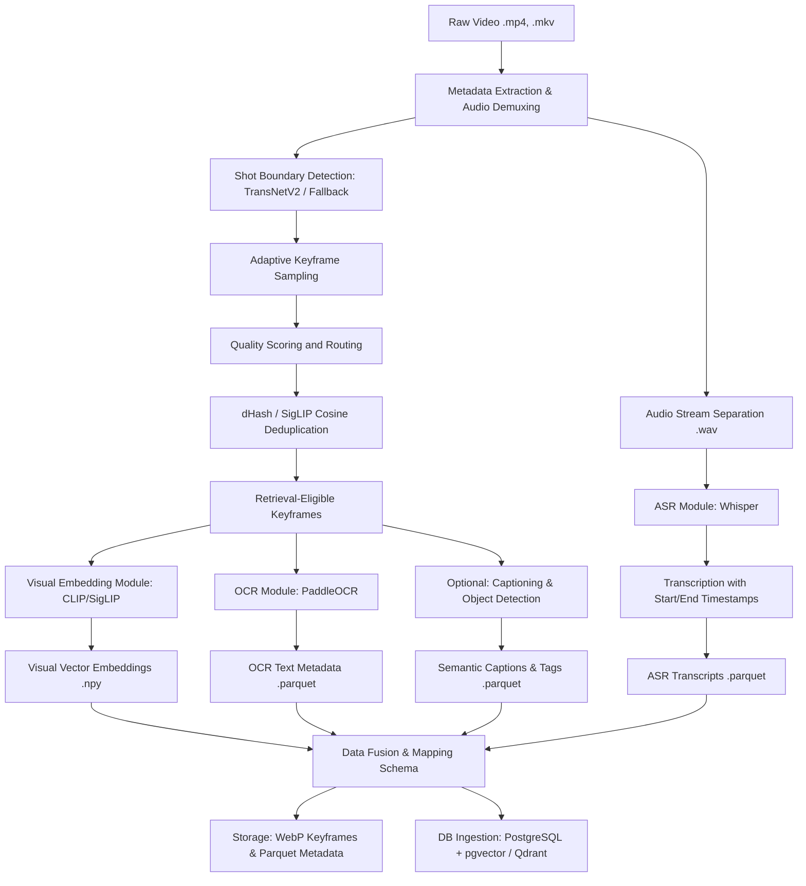

# Ho Chi Minh City AI Challenge 2026: Multimedia Preprocessing Pipeline

## Overview
This repository serves as the official, primary codebase for the Ho Chi Minh City AI Challenge 2026. It encapsulates the comprehensive Multimedia Preprocessing Pipeline and the advanced Retrieval System designed to tackle complex, large-scale video and segment search tasks using Natural Language Queries (NLQ).

## Directory Structure
The source code within this repository is organized systematically to promote modularity and scalability:

- **`apps/`**: Contains the core application modules, user interfaces, and primary online service APIs.
- **`artifacts/`**: Serves as the storage directory for intermediate outputs, pre-trained model weights, and compiled build artifacts.
- **`configs/`**: Houses all system configuration files (YAML/JSON), encompassing hyper-parameters for both the data processing pipelines and the deep learning models.
- **`contracts/`**: Defines the data schemas and API contracts essential for ensuring seamless integration and data consistency across various system modules.
- **`data/`**: Designated for raw video ingestion, metadata storage, and structured indexing outputs.
- **`docs/`**: Provides comprehensive system design documentation, architectural guidelines, and technical references.
- **`eval/`**: Incorporates the evaluation frameworks, validation scripts, and query datasets utilized to measure system performance metrics (e.g., Recall, mAP, MRR).
- **`experiments/`**: Dedicated to Research and Development, containing Jupyter Notebooks and experimental scripts for model fine-tuning and exploratory data analysis.
- **`pipelines/`**: The core component housing the offline and online processing pipelines, including Keyframe Extraction, Deduplication, Visual Embedding (CLIP/SigLIP), Optical Character Recognition (OCR), and Automatic Speech Recognition (ASR).

The implemented keyframe pipeline and its exact-frame output contract are
documented in [`pipelines/preprocessing/README.md`](pipelines/preprocessing/README.md).
The supported GitHub-to-Kaggle deployment using raw video from Cloudflare R2
is documented in [`docs/keyframe_kaggle_r2_runbook.md`](docs/keyframe_kaggle_r2_runbook.md).

## System Architecture
The system architecture follows a tiered processing paradigm. It leverages early-stage noise filtering mechanisms to drastically reduce the computational burden on resource-intensive deep learning models. A cornerstone of this design is the **Dynamic Keyframe Extraction** strategy.

The offline preprocessing workflow is illustrated below:

## Key Capabilities

1. **Multimodal Query Processing**: Seamlessly supports Visual Search, Optical Character Recognition (OCR), Automatic Speech Recognition (ASR), Semantic Captioning, and Object-based Retrieval.
2. **Computational Efficiency**: Employs rigorous Quality Filtering and Deduplication algorithms prior to feature extraction, significantly optimizing GPU utilization and processing throughput.
3. **Fault Tolerance and Recovery**: Implements a robust checkpointing mechanism by persisting intermediate states (.parquet/.npy formats), ensuring the pipeline can resume processing from the last successful execution point in the event of an interruption.
4. **Two-Stage Keyframe Foundation**: Preserves a zero-based, PTS-aware source
   identity for every decoded frame; builds sparse retrieval frames and event
   windows; supports optional DINOv2 structural deduplication/cluster medoids;
   and densely decodes candidate windows to an explainable semantic frame
   selection. Query-specific event models and full Textual KIS, VQA, or TRAKE
   handlers remain downstream work.

---
*For further technical specifications, please consult the documentation provided in the `docs/` directory.*
