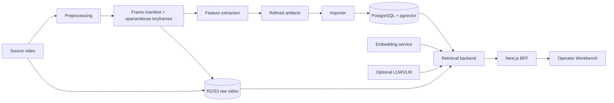

# AIC 2026 — Multimodal Video Search

This repository contains the codebase for the AIC 2026 video evidence search
and browsing system. It starts with source video, creates precisely identified
frames and multimodal features, loads them into the retrieval engine, and then
provides a Workbench where operators can select frames and create submission
previews.

## Current scope

The repository currently includes:

- two-stage preprocessing: sparse retrieval frames and dense exact-frame
  alignment;
- feature extraction for captioning, Vietnamese OCR, object detection, visual
  embeddings, and timeline-based ASR;
- shared JSON Schema contracts across the pipelines, ingestion, and backend;
- a NestJS retrieval backend with PostgreSQL/pgvector, full-text search, RRF
  fusion, R2 signed URLs, and degraded modes when dependencies are unavailable;
- a frame-first Next.js Workbench for `textual_kis`, VQA, and TRAKE;
- manual selection, JSON/CSV submission previews, and CSV export of nearby
  frames around a user-selected center frame (1–50 frames, including the
  center frame).

The backend currently creates previews for validation. The official submission
adapter for the competition system is outside this repository. Some retrieval
branches and models are optional and are reported as `unavailable` when the
corresponding artifact or service has not been configured.

## Architecture



`original_frame_id` is the canonical source-frame identifier and starts at
`0`. Timestamps are supporting metadata only; once `original_frame_id` exists,
do not derive a frame from a timestamp.

## Run locally

### Requirements

- Docker Desktop running;
- Node.js `>=20`;
- Python `3.11+`;
- `ffmpeg` and `ffprobe` available in `PATH` for probing, ASR, and exact-frame
  decoding;
- `npm` for the backend and Corepack/pnpm for the frontend.

### Start the database and embedding service

From the repository root:

```powershell
Copy-Item apps/backend/.env.example apps/backend/.env
docker compose up -d --build postgres embedding
```

Open `apps/backend/.env` and configure at least `DATABASE_URL` and
`DATABASE_DIRECT_URL` to point to the local PostgreSQL instance on port `5433`.
Set `EMBEDDING_SERVICE_URL=http://127.0.0.1:8001/embed` to enable the CLIP
branch. Do not commit real R2/API keys or expose them in the frontend.

### Migration and backend

```powershell
Set-Location apps/backend
npm install
npm run db:migrate
npm run db:verify
npm run start:dev
```

### Frontend

Open another terminal:

```powershell
Set-Location apps/frontend
corepack enable
pnpm install
pnpm dev
```

Open <http://localhost:3000>. If `BACKEND_API_URL` is empty, the frontend uses
deterministic fixtures for search. Operations that require the backend return a
clear error instead of writing fake data. Full instructions are in
[apps/frontend/README.md](apps/frontend/README.md).

### Import features into the database

After refined artifacts are available, run a dry-run before importing:

```powershell
python -m pip install -r pipelines/ingestion/requirements.txt
$env:PYTHONPATH = (Get-Location).Path
python -m pipelines.ingestion.import_refined `
  --data-root D:\data\refined `
  --dry-run
```

After validation succeeds, remove `--dry-run`, provide the database URL, and
run `npm run db:build-indexes` followed by `npm run db:verify` in
`apps/backend`. The artifact layout and import phases are documented in
[pipelines/ingestion/README.md](pipelines/ingestion/README.md).

### Run the complete stack with Docker

After preparing `apps/backend/.env` and applying the migration, you can run:

```powershell
docker compose up -d --build
```

The default ports are frontend `3000`, backend `4000`, embedding `8001`, and
PostgreSQL `5433`. This Compose setup is intended for local development; change
credentials and restrict the network before using it outside a development
machine.

## Common commands

| Scope | Command | Purpose |
|---|---|---|
| Backend | `npm run start:dev` | Run NestJS in watch mode |
| Backend | `npm run db:migrate` | Apply migrations |
| Backend | `npm run db:build-indexes` | Create FTS/trigram/HNSW indexes after import |
| Backend | `npm run db:verify` | Check schema, indexes, and release state |
| Backend | `npm test` / `npm run test:coverage` | Run unit/integration tests and coverage |
| Backend | `npm run typecheck` / `npm run build` | Check TypeScript and build |
| Frontend | `pnpm dev` | Run the Next.js development server |
| Frontend | `pnpm test` / `pnpm test:coverage` | Run component, route, and utility tests |
| Frontend | `pnpm test:e2e` | Run the Playwright qualification flow |
| Frontend | `pnpm typecheck` / `pnpm lint` / `pnpm build` | Check the frontend |
| Pipelines | `python -m unittest discover -s tests -q` | Test pipelines and contracts |
| Preprocessing | `python -m pipelines.preprocessing.cli --help` | List offline stages |
| Greenfield pipeline | `python -m pipelines.main --help` | List local/hybrid/Modal DAG commands |

Run Node commands from the relevant subdirectory; the repository has no root
`package.json`.

## Repository map

| Directory | Role |
|---|---|
| `apps/frontend/` | Next.js Workbench and BFF routes |
| `apps/backend/` | NestJS retrieval API, database adapter, media, and task executor |
| `contracts/` | Shared JSON Schema and semantic validation |
| `pipelines/preprocessing/` | Frame manifest, sparse sampling, dense decoding, and indexing |
| `pipelines/feature_extraction/` | ASR, captioning, OCR, object, and visual embeddings |
| `pipelines/ingestion/` | Validate/import refined artifacts into PostgreSQL |
| `pipelines/main/` | Greenfield DAG orchestration for local/hybrid/Modal runs |
| `embedding_services/` | FastAPI CLIPA text/image embedding service |
| `docs/` | PRD, design, testing notes, and deployment runbooks |
| `data/`, `artifacts/`, `outputs/` | Local data storage layout; most output is gitignored |
| `eval/`, `experiments/` | Evaluation and experimentation areas |

Raw video, model weights, `.env` files, Parquet/NumPy output, and local caches
are not tracked in source control. Review `.gitignore` before sharing or
staging artifacts.

## Module READMEs

- [Frontend Workbench](apps/frontend/README.md)
- [Backend retrieval API](apps/backend/README.md)
- [Contract boundary](contracts/README.md)
- [Video preprocessing](pipelines/preprocessing/README.md)
- [Refined database ingestion](pipelines/ingestion/README.md)
- [Greenfield pipeline](pipelines/main/README.md)
- [ASR](pipelines/feature_extraction/asr/README.md)
- [Image captioning](pipelines/feature_extraction/captioning/README.md)
- [Vietnamese OCR](pipelines/feature_extraction/ocr/README.md)
- [Object detection](pipelines/feature_extraction/object_detection/README.md)
- [Unified feature extraction](pipelines/feature_extraction/unified/README.md)
- [Visual embedding](pipelines/feature_extraction/visual_embedding/README.md)
- [Query embedding service](embedding_services/README.md)

## Related operational documentation

- [Local Docker runbook](RUNBOOK_LOCAL_DOCKER.md)
- [GitHub → Kaggle → R2 keyframe runbook](docs/keyframe_kaggle_r2_runbook.md)
- [VLM team guide](HUONG_DAN_VLM_TEAM.md)
- [Contract compatibility policy](contracts/versioning/compatibility_policy.md)
- [Testing/design notes](docs/testing/)

When changing schema, identity, or artifact output, update the relevant
contract and module README in the same change. README files explain the
interfaces; they are not the source of truth for machine-readable data.
