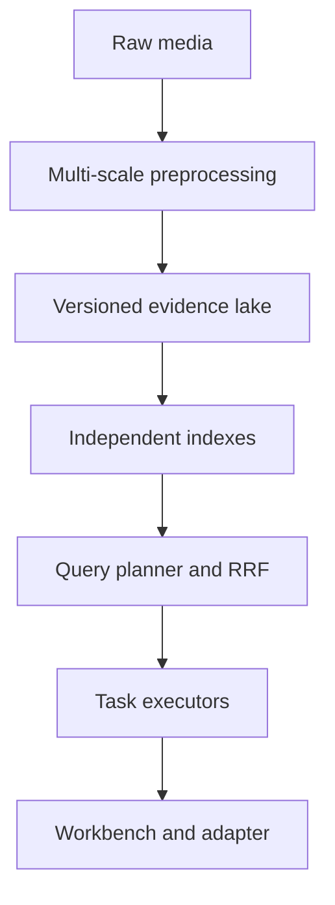
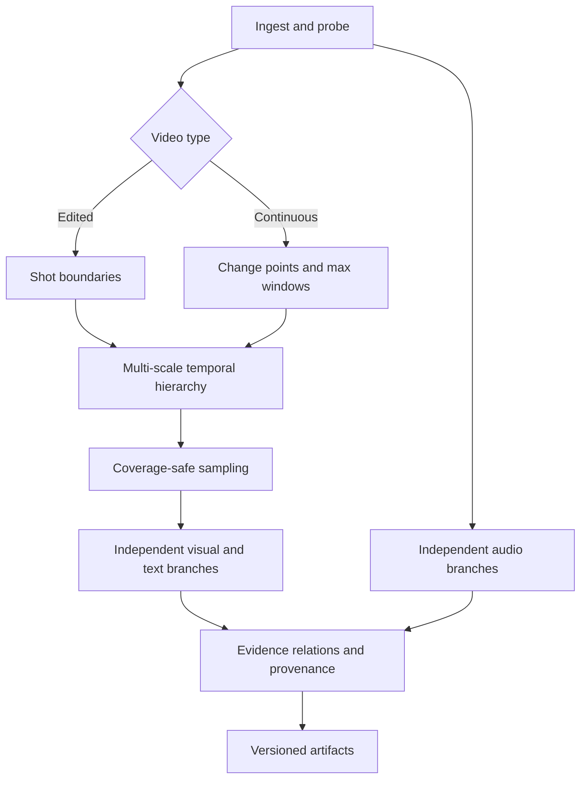
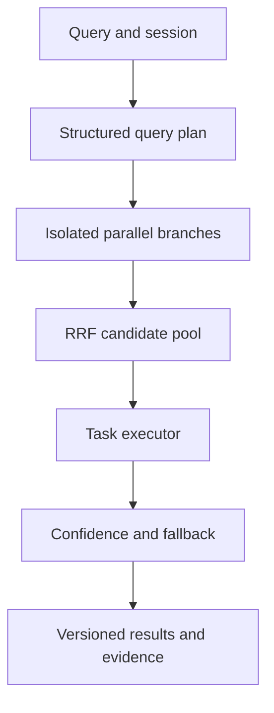

# Product Requirements Document — AIC HCMC 2026 Multimodal Retrieval Assistant

**Document status:** Development-ready robust architecture baseline  
**Version:** 2.4  
**Last updated:** 2026-07-17  
**Target competition:** Ho Chi Minh City AI Challenge 2026 — Group A baseline, adaptable to Group B  
**Product scope:** End-to-end multimedia preprocessing, multimodal retrieval, operator UI, grounded VQA, and replaceable competition integration  
**Audience:** AI/ML, data, backend, frontend, DevOps, evaluation, and competition operations  
**Source documents:** `PRD.md` v1.0 and [`docs/pipeline/aic_preprocessing_pipeline.pdf`](docs/pipeline/aic_preprocessing_pipeline.pdf)  
**Decision rule:** Organizer rules override this PRD. Unknown competition behavior must remain configurable or isolated behind adapters.
**Revision summary:** v2.4 standardizes NestJS modules under `apps/backend/src/`, defines the NestJS BullMQ worker→Python runner contract, makes Prisma conditional on a pgvector/migration spike, and freezes deterministic contract generation.

> **One-sentence product definition**  
> Convert long, noisy multimedia into timestamp-accurate evidence, retrieve the smallest useful set of segments for KIS/AVS/VQA/KISC, and let a human operator inspect and submit results quickly without coupling the product to an unknown organizer protocol.

## 1. Product definition

### 1.1 Executive summary

The team will build a **segment-oriented, cheap-first, multimodal retrieval assistant** for the Ho Chi Minh City AI Challenge 2026. It consists of four products behind stable contracts:

1. an offline preprocessing platform that turns raw video/audio into versioned evidence;
2. an ingestion and indexing layer that validates and serves that evidence;
3. a low-latency retrieval backend for visual, OCR, ASR, caption, object, and non-speech audio search;
4. a keyboard-first web workbench for interactive retrieval, evidence inspection, VQA, conversational narrowing, and reviewable submission.

The official site currently confirms a multimedia virtual-assistant theme, teams of up to five, Group A and Group B, traditional human-operated retrieval, and a pilot automatic assistant-versus-assistant mode. The exact dataset contract, scoring, answer normalization, result format, authentication, rate limits, query timeout, false-submission penalties, deployment restrictions, and automated protocol remain unconfirmed as of 2026-07-17. Therefore, the team can start backend and frontend development now using an **internal canonical contract**, while all organizer-specific behavior remains in a replaceable competition adapter.

The central retrieval unit remains a temporal `segment`, but it now belongs to a **multi-scale hierarchy**: frame → micro-event → segment → context window. Every searchable signal must retain its source, half-open time interval `[start_ms, end_ms)`, extraction version, confidence, and provenance. Quality checks are mostly soft scores and routing signals. The pipeline must preserve temporal coverage and may permanently discard only proven technical failures.

The online system must not apply one ranking policy to every task. A structured query planner selects independent evidence branches, RRF produces a robust candidate pool, and a task-specific executor applies the final policy for Textual KIS, Video KIS, AVS, VQA, or KISC. Failure of one branch must produce a versioned degraded response rather than fail the whole query.

### 1.2 Competition context and evidence status

#### Confirmed by the official competition site

| Item | Current status |
|---|---|
| Competition | Ho Chi Minh City Artificial Intelligence Challenge 2026 |
| Product theme | Intelligent virtual assistant for deep analysis and retrieval over large multimedia collections containing image, audio, and text |
| Format inspiration | Lifelog Search Challenge and Video Browser Showdown |
| Team size | Individual or team; maximum five members |
| Groups | Group A: university students/youth interested in IT and AI; Group B: high-school students |
| Traditional mode | A user operates the team assistant to process multimedia queries |
| Automatic mode | Pilot competition between teams' automated assistants |
| Registration | Through 2026-06-15 |
| Qualification | Expected in August 2026; result expected 2026-08-30 |
| Final | Expected from 2026-09-12 through 2026-09-26 |

Official reference: [AI Challenge HCMC 2026 website](https://aichallenge.hochiminhcity.gov.vn/).

#### Working task model from the team's materials

| Task | Product behavior | Primary success signal |
|---|---|---|
| Textual KIS | Find one exact target moment from a natural-language description | Correct segment appears early with accurate timestamp |
| Video KIS | Help an operator reconstruct and find a shown target clip | Fast visual similarity, facets, clusters, and neighborhood browsing |
| AVS | Return many valid and diverse examples for a semantic concept | High relevance with low temporal/cluster duplication |
| VQA | Retrieve temporal evidence, then produce a concise grounded answer | Correct evidence and answer; provenance is visible |
| KISC | Ask useful clarification questions and refine candidates across turns | Fewer candidates and successful retrieval in few turns |

The approximately five-hour continuous smart-glasses scenario described in prior training material is a **working dataset characteristic**, not a final organizer guarantee.

### 1.3 Problem statement

Long multimedia collections are difficult to search because evidence is distributed across frames, visible text, speech, environmental sounds, and temporal events. Edited-video shot detection alone fails on continuous or egocentric footage. Fixed keyframe sampling can miss short events. Aggressive quality filtering can remove the only valid target. A frame-only data model loses dialogue and temporal context. A single visual vector branch cannot reliably answer OCR-, ASR-, audio-, counting-, or order-dependent queries.

The system must answer:

> Given an ambiguous Vietnamese, English, or mixed-language query, which temporally precise segments best satisfy the request, what evidence supports each result, and what should the operator inspect or submit next?

### 1.4 Product principles

1. **Multi-scale time, segment-centered retrieval.** Frames, micro-events, segments, and context windows share one canonical timeline; segments remain the default result unit.
2. **Coverage before compression.** Never reduce cost by losing the only evidence for an event.
3. **Score before discard.** Blur, darkness, contrast, and duplication normally become features, not deletion rules.
4. **Modality-specific selection.** A poor visual frame may be an excellent OCR frame; a static scene may contain decisive audio.
5. **Edited and continuous paths.** The pipeline selects different segmentation strategies without manual rewiring.
6. **Intervals are first-class.** ASR, OCR tracks, sound events, captions, and objects can overlap multiple frames and segments.
7. **Cheap first, expensive selectively.** Run probing and lightweight selection before clip encoders or VLMs.
8. **Offline-heavy, online-light.** Precompute evidence and indexes so common retrieval remains under the live latency budget.
9. **Evidence over hallucination.** Captions and generated answers are retrieval branches, not ground truth.
10. **Idempotent and resumable.** Each stage has typed inputs, deterministic identities, checkpoints, and versioned outputs.
11. **Local-first compliance.** External APIs are disabled until rules and data permissions explicitly allow them.
12. **Rules as adapters.** No organizer-specific schema, timestamp unit, scoring formula, or authentication flow is hard-coded.
13. **Task-specific execution.** Shared candidate generation is followed by a task-aware final policy rather than one universal ranker.
14. **Graceful degradation.** A branch timeout or failure reduces available evidence but does not invalidate the whole search request.
15. **Confidence controls action.** Low-confidence retrieval triggers expansion, clarification, or abstention; it never silently triggers submission.

### 1.5 Users and stakeholders

| User | Primary need |
|---|---|
| Competition operator | Find, compare, play, and submit the correct moment quickly |
| AI/ML engineer | Swap models, rerun one branch, benchmark contribution, inspect failures |
| Data engineer | Ingest safely, validate schemas, maintain provenance and indexes |
| Backend engineer | Consume stable evidence contracts and expose low-latency APIs |
| Frontend engineer | Build against mockable contracts before full preprocessing is ready |
| VQA engineer | Retrieve multi-segment evidence with timestamps and provenance |
| Evaluator/data scientist | Maintain queries, judgments, metrics, ablations, and error reports |
| DevOps | Reproduce deployments, monitor jobs, snapshot indexes, and restore offline |

### 1.6 Goals and success criteria

#### Product goals

- Process the complete available dataset end to end with resumable, versioned jobs.
- Preserve timestamp-accurate visual, OCR, ASR, caption, object, and optional non-speech audio evidence.
- Support KIS, AVS, VQA, and KISC through one retrieval platform.
- Return useful first results fast enough for a live operator.
- Make every result explainable through evidence chips, intervals, scores, and source previews.
- Let backend and frontend development proceed against a frozen internal contract while preprocessing evolves.
- Rebuild indexes from stored evidence without decoding source media again.
- Run fully offline in a competition-safe profile.

#### Working engineering targets

These are internal targets, not organizer scoring rules.

| Area | Initial target |
|---|---|
| Timeline coverage | 100% of valid decoded duration assigned to segments, excluding declared gaps |
| Evidence coverage | Every non-audio-only segment has at least one preview and visual candidate |
| Timestamp accuracy | Preview resolves within one source frame or 100 ms, whichever is larger |
| Ingestion reliability | At least 99% of valid videos complete without manual intervention |
| Retrieval latency | P95 under 500 ms per core branch on target hardware |
| First result | P95 under 1 second for baseline hybrid search |
| Fused top results | P95 under 1.5 seconds excluding optional VLM reranking |
| VLM reranking | Asynchronous or within a separate 2–5 second budget |
| Search quality | Establish a versioned baseline on at least 100 labeled queries before model expansion |
| Reproducibility | Same source, config, and model revision produce stable IDs and equivalent outputs |
| Degraded retrieval | Failure of any one optional branch still returns a valid response from healthy branches |
| Version coherence | Every response identifies one compatible dataset, pipeline, schema, and active index version |
| Regression safety | No model/index release activates when a task-specific quality or latency gate fails |

### 1.7 Scope

#### P0 — qualification-ready MVP

- dataset manifest, checksum, probe, timestamp normalization, and preview media;
- dual-mode temporal segmentation, multi-scale temporal hierarchy, and coverage-safe sampling;
- soft quality tiering and modality-aware duplicate clusters;
- SigLIP 2-compatible keyframe retrieval branch, subject to local benchmark;
- high-resolution OCR with temporal spans/tracks;
- VAD-chunked ASR with segment and optional word timestamps;
- PostgreSQL + pgvector + PostgreSQL full-text search;
- internal ingestion, media, search, query-plan, segment-evidence, session, VQA, and degraded-response contracts;
- query normalization, Vietnamese/English handling, structured query planning, parallel isolated retrieval, RRF, temporal grouping, and diversity;
- baseline task executors for Textual KIS, Video KIS, AVS, VQA evidence retrieval, and KISC session refinement;
- confidence-aware fallback, branch timeouts/circuit breakers, and version-coherent partial results;
- NestJS/TypeScript backend, Redis/BullMQ consumed only by NestJS workers, a typed NestJS→Python CLI runner for batch preprocessing, an internal Python inference runtime for online PyTorch models, HTTP Range media delivery through Nginx or equivalent, React/Next.js frontend, and Docker Compose;
- operator workbench with query, results, playback, evidence, neighborhood, keyboard controls, and reviewable submission preview;
- evaluation suite, run manifests, metrics, safe-mode profile, snapshots, and restore rehearsal.

#### P1 — accuracy upgrades after a measurable baseline

- InternVideo2 segment/clip embeddings;
- DINOv3 semantic clustering and diversity features;
- CLAP non-speech audio embeddings;
- optional sound-event detection with temporal onset/offset;
- multi-granularity captions;
- YOLO-World open-vocabulary object evidence on selected frames;
- query-aware frame selection and temporal-boundary refinement;
- dynamic branch weighting or learned fusion;
- top-K temporal or VLM reranking;
- AVS diversity controls and grounded VQA evidence bundles;
- KISC clarification policy based on searchable facets.
- richer temporal evidence relations, entity mentions, object tracks, and cross-segment event links.

#### Deferred experiments, not baseline dependencies

- PaddleOCR-VL;
- InternVideo2.5 or later large video MLLMs;
- Grounded-VideoLLM-style reranking;
- Omni-Embed-Nemotron or another unified embedding branch;
- very new query-adaptive selection methods before reproducible local evaluation;
- distributed vector/search infrastructure before PostgreSQL limits are measured;
- diarization unless queries demonstrate clear benefit;
- contextual bandits, online learning, or fully autonomous submissions.

#### Non-goals

- training a foundation model from scratch;
- face identification or biometric recognition;
- processing every frame at source frame rate;
- running captioning, VLMs, or object detection on every frame;
- hard-wiring organizer APIs or scoring assumptions;
- sending competition data to third-party services by default;
- guaranteeing VQA correctness through preprocessing alone;
- building a general consumer video platform outside the competition workflow.

### 1.8 Assumptions and constraints

- Linux is the primary runtime; CPU fallbacks exist for probe, sampling, quality, validation, and degraded retrieval.
- NVIDIA GPU acceleration is preferred but model adapters must allow smaller checkpoints.
- Source media is immutable; generated code must never mutate it.
- Paths stored in data contracts are relative paths or URIs, never machine-specific absolute paths.
- Internal canonical timestamps use integer milliseconds and half-open intervals `[start_ms, end_ms)`.
- Internal IDs are stable across reruns; organizer identifiers are mapped only at the adapter boundary.
- The frontend must run against fixtures and mock APIs before production indexes exist.
- All thresholds, model names, and feature flags live in versioned configuration.
- Safe mode disables external network calls and unsupported competition functionality.
- The minimum deployable system must remain useful when clip, caption, object, CLAP, SED, reranking, or VQA-generation branches are disabled.

## 2. System specification

### 2.1 End-to-end architecture



#### Runtime boundaries

| Boundary | Owns | Must not own |
|---|---|---|
| Preprocessing | Media decode, segmentation, evidence extraction, artifact manifests | Live query fusion or organizer submission |
| Ingestion/indexing | Schema validation, idempotent upsert, index build/version | Model inference unrelated to ingestion |
| Retrieval backend | Query planning, branch retrieval, fusion, grouping, evidence bundles | Direct knowledge of organizer payloads |
| Media service | Secure byte-range video/proxy delivery and preview assets | Retrieval ranking |
| Frontend | Operator interactions, playback, evidence visualization, session state | Direct database access or irreversible submission |
| VQA/KISC | Evidence-grounded answering and clarification | Ungrounded answers or hidden automatic submission |
| Competition adapter | Authentication, payload conversion, submit/status protocol | Internal retrieval logic |
| Batch job worker | BullMQ consumption, durable run coordination, bounded Python child-process ownership | Media/ML implementation or direct artifact mutation |

#### Architectural invariants

- All temporal artifacts use one canonical PTS-aligned timeline and half-open millisecond intervals.
- The hierarchy `frame → micro_event → segment → context_window` is materialized, versioned, and navigable in both directions.
- Each modality publishes independent evidence and an independent index; fusion occurs only in the online retrieval layer.
- Shared candidate generation ends at a fused, provenance-rich pool. Task executors own task-specific ranking and output behavior.
- Every online response is coherent with exactly one `dataset_version`, `pipeline_version`, `schema_version`, and `index_version`.
- Optional branches may fail independently. Healthy branches still return a contract-valid degraded response.
- Only NestJS workers consume BullMQ. Batch Python is invoked through a typed runner contract and never reads BullMQ/Redis internals directly.

### 2.2 Offline preprocessing pipeline



#### PRE-001 — Dataset ingest and source manifest

The system shall accept directory trees, organizer manifests, organizer-provided derived assets, and incremental dataset additions.

Required output per source:

- `dataset_id`, `video_id`, relative path, original organizer ID if present;
- SHA-256 checksum, byte size, ingest time, source metadata, license/usage note;
- provided asset inventory, ingest status, structured error;
- immutable reference to the raw source.

Acceptance criteria:

- rerunning ingest creates no duplicate video records;
- content changes under the same filename are detected;
- one corrupt file does not stop the batch;
- all failures identify `video_id`, stage, recoverability, and retry guidance.

#### PRE-002 — Media probe and timestamp normalization

Use `ffprobe`, PyAV, or equivalent to record container, codecs, streams, duration, resolution, rotation, frame-rate metadata, audio format, variable-frame-rate status, and presentation timestamps.

Acceptance criteria:

- frame identity derives from PTS, not assumed constant-FPS frame numbers;
- rotated footage is displayed correctly;
- no-audio media is valid;
- source, proxy, preview, and segment timestamps resolve to the same moment within tolerance.

#### PRE-003 — Video-type classification and multi-scale temporal hierarchy

Classify a video or long section as `edited`, `continuous`, `screen_or_slide`, or `uncertain`. Allow an explicit config override.

- Edited path: TransNetV2 or equivalent, with histogram fallback.
- Continuous path: maximum-duration windows combined with embedding/histogram change points, motion change, OCR layout change, and audio activity boundaries.
- Materialize four related granularities:
  - `frame`: one presentation timestamp for visual/OCR evidence;
  - `micro_event`: normally 1–3 seconds for brief actions and precise KIS;
  - `segment`: normally 4–8 seconds and the default retrieval result;
  - `context_window`: normally 15–30 seconds for VQA, counting, order, and before/after reasoning.
- Working defaults remain configuration, not competition assumptions. Context windows may overlap; each lower-level node records its parent and ordered siblings.

Acceptance criteria:

- every valid decoded interval belongs to at least one segment and one context window;
- long continuous footage does not depend on visible cuts;
- temporal IDs remain stable when unrelated model branches change;
- overlap and coverage rules are validated automatically.
- parent-child containment, sibling order, and adjacency have no critical integrity errors.

#### PRE-004 — Coverage-safe adaptive sampling

Create candidate frames from the union of micro-event/segment midpoints, boundary-safe endpoints, uniform samples, strong visual-change points, high-quality points, OCR-change points, and selected action/object changes. Store which temporal level and selection policy caused each candidate to be retained.

Acceptance criteria:

- at least one preview per non-audio-only segment;
- no uncovered gap exceeds configuration;
- long/dynamic segments receive more candidates within a per-hour budget;
- sampling can be rerun without rerunning OCR, ASR, or indexes until outputs are accepted.

#### PRE-005 — Soft quality tiering

Compute luminance statistics, saturation/clipping, sharpness, contrast/entropy, motion, compression/blocking estimate, and text likelihood. Assign one of:

- `primary` — good for general visual retrieval;
- `modality_specific` — useful for OCR, motion, or another branch;
- `fallback` — retained for temporal coverage;
- `invalid` — proven decode failure, corruption, or fully unusable technical artifact.

Acceptance criteria:

- darkness, blur, flat color, or low contrast alone never causes permanent deletion;
- thresholds are data-calibrated and versioned;
- quality features remain queryable for analysis and routing.

#### PRE-006 — Near-duplicate clustering

Use pHash for cheap candidates and optional DINOv3 or another semantic feature for validation/diversity. Guard against merging when OCR, ASR boundary, object state, segment boundary, or temporal distance differs materially.

Acceptance criteria:

- retain all cluster members in the evidence lake;
- select separate representatives when modality needs differ;
- store `cluster_id`, representative rank, similarity, and decision provenance;
- online AVS can suppress repeated cluster/temporal neighbors.

#### PRE-007 — Visual image embeddings

Baseline candidate: SigLIP 2 for multilingual image-text retrieval, selected only after an internal Vietnamese/English benchmark against the existing CLIP/SigLIP baseline.

Requirements:

- adapter-defined model family, revision, dimension, transform, normalization, dtype, and license;
- batched mixed-precision inference where supported;
- sharded or memory-mapped outputs;
- query encoder compatibility test before index build;
- image embeddings stored separately from metadata rows.

#### PRE-008 — Segment/clip embeddings

P1 candidate: InternVideo2 for representative clips and action/temporal retrieval.

Requirements:

- no P0 dependency;
- benchmark frame-only versus frame-plus-clip retrieval;
- sample clips from stable segment intervals;
- store temporal sampling strategy and model version;
- index as a separate branch so it can be disabled without data migration.

#### PRE-009 — OCR and temporal tracks

Baseline candidate: PP-OCRv5 or the best locally benchmarked Vietnamese-capable OCR pipeline.

Requirements:

- use high-resolution source/crop input, not only compressed preview WebP;
- preserve raw text, normalized text, no-diacritic auxiliary form, language, box/polygon, confidence, and frame timestamp;
- consolidate repeated adjacent detections into `ocr_tracks` with `[start_ms, end_ms)`;
- allow crop re-recognition for small high-value text;
- run on OCR-selected candidates even when they are not the best visual frames.

Acceptance criteria:

- Vietnamese diacritics are preserved in raw output;
- temporal tracks remain linked to frame-level detections;
- OCR model replacement requires rerunning only the OCR branch and dependent indexes.

#### PRE-010 — Speech branch: VAD, ASR, and alignment

Audio is a first-class branch, not a frame attribute:

`audio stream → canonical audio → VAD → overlapped chunks → ASR → optional word alignment → interval spans`

Baseline implementation:

- preserve original audio;
- derive canonical mono 16 kHz audio when required;
- use Silero VAD or a benchmarked equivalent;
- use faster-whisper or equivalent local ASR;
- use WhisperX-style forced alignment when word timestamps materially improve retrieval;
- chunk long audio, initially 30 seconds with 2-second overlap, and checkpoint per chunk;
- preserve raw and normalized text, language, confidence/no-speech score, segment timestamps, optional word timestamps;
- build lexical and semantic text indexes;
- treat denoising as an additional artifact, never an overwrite of raw audio;
- defer diarization unless the evaluation set contains speaker-dependent questions.

#### PRE-011 — Non-speech audio branch

P1 baseline: CLAP-style audio-text embeddings for events such as vehicle sounds, horns, alarms, impacts, music, appliances, crowds, or animal sounds that ASR cannot represent.

Optional SED adds onset/offset and class confidence when temporal localization is needed. SED is enabled only if ablation shows improvement on non-speech or temporal audio queries. CLAP and SED are complementary:

- CLAP retrieves open-ended semantic audio descriptions;
- SED emits time-localized events from a known or configured vocabulary.

Acceptance criteria:

- audio embeddings and sound events are independent of ASR spans;
- event timestamps map to segments without being copied onto a single frame;
- silence and speech-only intervals do not generate misleading event labels;
- the branch can be disabled without affecting core visual/ASR search.

#### PRE-012 — Captions and object evidence

P1 only after baseline measurement.

- Captions: use segment-aware and multi-granularity captions; preserve prompt/model revision; treat captions as fallible retrieval evidence.
- Objects: run YOLO-World or a benchmarked detector only on selected frames/clips; retain label/prompt, box, confidence, timestamp, and optional track identity.
- Never run either module on all frames by default.

#### PRE-013 — Evidence fusion and artifact publication

All modality outputs map to stable temporal nodes or free intervals and publish atomically with a run manifest. The pipeline must write intermediate artifacts before database ingestion.

Required output tree:

```text
artifacts/pipeline_runs/<dataset_id>/<pipeline_version>/
├── videos_manifest.json
├── micro_events.parquet
├── segments.parquet
├── context_windows.parquet
├── frames.parquet
├── keyframes/
├── keyframes_metadata.parquet
├── visual_embeddings/
├── clip_embeddings/
├── ocr_spans.parquet
├── ocr_tracks.parquet
├── audio_manifest.parquet
├── audio_chunks.parquet
├── asr_spans.parquet
├── audio_embeddings/
├── sound_events.parquet
├── captions.parquet
├── objects.parquet
├── object_tracks.parquet
├── entity_mentions.parquet
├── temporal_edges.parquet
├── evidence_relations.parquet
├── processing_runs.parquet
├── validation_report.json
└── ingestion_log.json
```

#### PRE-014 — Lightweight temporal evidence graph

Publish relational nodes and edges that support multi-event retrieval without requiring a graph database.

Minimum relations:

- `contains`, `previous`, `next`, and `overlaps` between temporal nodes;
- `mentions` between OCR/ASR/captions and normalized entities;
- `tracks` between repeated object detections or OCR detections;
- `supports` between evidence and a candidate event/answer;
- benchmark-gated semantic relations such as `before`, `after`, `same_entity`, and `state_change`.

Acceptance criteria:

- all edges reference valid nodes/evidence from the same compatible dataset and pipeline version;
- adjacency and containment can be reconstructed without reading media;
- graph enrichment is optional: the core hierarchy and direct evidence remain usable if semantic relation extraction is disabled;
- relation provenance identifies whether the edge is deterministic, model-derived, or operator-confirmed.

### 2.3 Canonical data contract

#### Identity and time rules

- `dataset_id`: stable logical dataset version.
- `video_id`: deterministic from dataset namespace plus organizer ID or normalized source identity.
- `segment_id`: deterministic from `video_id`, segmentation version, and canonical interval.
- `micro_event_id`: deterministic from `video_id`, temporal schema version, and canonical interval.
- `context_window_id`: deterministic from `video_id`, temporal schema version, and canonical interval.
- `frame_id`: deterministic from `video_id` and presentation timestamp.
- `evidence_id`: deterministic from evidence type, parent identity, interval, and producer version.
- `start_ms` is inclusive; `end_ms` is exclusive.
- Integer milliseconds are canonical internally; adapters may convert units.
- Raw organizer IDs are preserved in mapping tables; never replace canonical IDs.

#### Core logical tables

| Table | Required fields | Purpose |
|---|---|---|
| `datasets` | `dataset_id`, `version`, `status`, `source`, `created_at` | Dataset lifecycle |
| `videos` | `video_id`, path/URI, checksum, duration, streams, dimensions, PTS metadata | Source catalog |
| `micro_events` | `micro_event_id`, `video_id`, `segment_id`, interval, type, siblings | Brief actions and precise localization |
| `segments` | `segment_id`, `video_id`, `start_ms`, `end_ms`, type, overlap, neighbors | Primary retrieval unit |
| `context_windows` | `context_window_id`, `video_id`, interval, member segments, overlap | VQA and temporal reasoning context |
| `frames` | `frame_id`, `video_id`, `segment_id`, `timestamp_ms`, preview, quality tier/scores, cluster | Visual evidence |
| `visual_embeddings` | `frame_id`, family, revision, dimension, dtype, vector reference | Image retrieval |
| `clip_embeddings` | `segment_id`, interval, family, revision, sampling, vector reference | Video/action retrieval |
| `ocr_spans` | `evidence_id`, `frame_id`, text forms, polygon, confidence, language | Frame OCR |
| `ocr_tracks` | `track_id`, `video_id`, `start_ms`, `end_ms`, canonical text, member IDs | Temporal OCR |
| `audio_chunks` | `chunk_id`, `video_id`, interval, artifact, overlap, status | Resumable audio work |
| `asr_spans` | `evidence_id`, `video_id`, interval, raw/normalized text, language, confidence, words | Speech retrieval |
| `audio_embeddings` | `evidence_id`, interval, model, vector reference | Non-speech audio retrieval |
| `sound_events` | `evidence_id`, interval, label, confidence, producer | Time-localized audio events |
| `captions` | `evidence_id`, parent type/ID, interval, language, text, model/prompt | Caption retrieval |
| `objects` | `evidence_id`, frame/track ID, label/prompt, box, confidence, interval | Object retrieval |
| `object_tracks` | `track_id`, `video_id`, interval, label, member detections | Counting and state continuity |
| `entity_mentions` | `mention_id`, evidence ID, entity key/type, interval, confidence | Cross-modal entity linking |
| `temporal_edges` | source node, target node, relation, confidence, producer | Hierarchy, adjacency, and event order |
| `evidence_relations` | source evidence, target evidence/node, relation, provenance | Evidence graph |
| `processing_runs` | `run_id`, stage, config hash, model versions, status, timing, errors | Reproducibility |
| `artifacts` | `artifact_id`, run ID, URI, checksum, schema version, size | Published outputs |

#### Example canonical segment bundle

```json
{
  "segment_id": "vid_0001_seg_000042",
  "video_id": "vid_0001",
  "granularity": "segment",
  "micro_event_ids": ["vid_0001_evt_000101", "vid_0001_evt_000102"],
  "context_window_ids": ["vid_0001_ctx_000010"],
  "start_ms": 12000,
  "end_ms": 18000,
  "refined_start_ms": 12600,
  "refined_end_ms": 17100,
  "representative_frame": {
    "frame_id": "frm_000385",
    "timestamp_ms": 15400,
    "preview_url": "/v1/media/frames/frm_000385"
  },
  "neighbors": {
    "previous_segment_id": "vid_0001_seg_000041",
    "next_segment_id": "vid_0001_seg_000043"
  },
  "evidence": [
    {
      "type": "ocr",
      "start_ms": 14800,
      "end_ms": 16800,
      "text": "123 Nguyễn Huệ",
      "confidence": 0.94,
      "producer": "pp-ocrv5:<revision>"
    },
    {
      "type": "asr",
      "start_ms": 13500,
      "end_ms": 16200,
      "text": "chỗ này rẽ phải rồi đi thẳng đúng không anh",
      "confidence": null,
      "producer": "faster-whisper:<revision>"
    }
  ]
}
```

### 2.4 Ingestion and serving storage

#### Baseline storage decision

- PostgreSQL: canonical relational catalog, processing state, sessions, judgments, and metadata.
- pgvector: baseline visual, clip, caption/text-semantic, and audio vectors.
- PostgreSQL full-text/trigram support: OCR, ASR, and caption lexical retrieval.
- File or S3-compatible object storage: raw media, proxies, keyframes, Parquet, vector shards, reports.
- Nginx or equivalent: authenticated HTTP Range serving for video/proxy playback.
- Qdrant: optional replacement/addition only after pgvector benchmark demonstrates a scaling or latency need.

#### ING-001 — Validation and idempotent upsert

- reject incompatible schema versions before partial indexing;
- validate referential integrity, interval bounds, embedding dimensions, checksums, and producer labels;
- upsert by canonical stable IDs;
- stage new index versions before activation;
- preserve previous active index until smoke tests pass;
- allow full index rebuild from evidence artifacts without re-decoding source media.

#### ING-002 — Index layout

Minimum indexes:

- vector: keyframe visual embeddings;
- lexical: OCR raw/normalized/no-diacritic forms;
- lexical and semantic: ASR spans;
- vector or lexical: captions;
- metadata: object labels, quality, source, time, clusters, languages;
- relational/temporal: hierarchy, adjacency, containment, tracks, entity mentions, and evidence relations;
- optional vector: clip embeddings and audio embeddings;
- optional temporal: sound events and OCR tracks.

Every index manifest records supported granularities, compatible schema/pipeline versions, model revision, distance/scoring semantics, build configuration, and activation state.

### 2.5 Online retrieval pipeline



#### RET-001 — Query compilation

For each query:

- preserve original text;
- detect Vietnamese, English, or mixed language;
- normalize whitespace/punctuation while preserving quoted text and numerals;
- optionally generate no-diacritic and English variants;
- identify hard filters only when explicit: `video_id`, camera/device, date/time, or source range;
- extract soft concepts: objects, actions, scene, OCR tokens, speech, audio event, temporal relation, count;
- infer or accept the task type and required temporal granularity;
- assign per-branch top-K, deadline, and optional fallback stages;
- store transformations and latency in a query trace.

OCR/ASR are scoring branches, not mandatory prefilters for every query.

#### RET-002 — Structured query plan and router

The router selects branches and budgets, but the P0 fallback always supports visual + OCR + ASR + caption/metadata when available.

The planner publishes a typed, inspectable plan rather than hidden prompt state:

```json
{
  "task": "vqa",
  "language": "vi",
  "query_variants": ["xe máy màu đỏ", "red motorcycle"],
  "concepts": ["red motorcycle", "store sign"],
  "text_constraints": ["123 Nguyễn Huệ"],
  "audio_concepts": [],
  "temporal_relations": ["after"],
  "target_granularities": ["segment", "context_window"],
  "branches": ["visual", "ocr_lexical", "clip"],
  "top_k_per_branch": 100,
  "latency_budget_ms": 1500,
  "fallback_policy": "expand_then_clarify"
}
```

P0 planning uses deterministic parsing, rules, and configuration. A local language model may enrich ambiguous plans, but retrieval must remain functional if it is unavailable.

Example routing:

| Query cue | Preferred branches |
|---|---|
| “biển hiệu”, quoted text, address, plate | OCR lexical + OCR semantic + visual |
| “nói”, “nghe”, remembered phrase | ASR lexical + ASR semantic + visual |
| siren, horn, engine, crash, music | CLAP/audio + optional SED + visual |
| action or temporal motion | clip embedding + visual + caption |
| named/rare object | visual + YOLO-World/object + caption |
| sequence, before/after, counting | multi-segment retrieval + temporal/VQA path |

#### RET-003 — Branch retrieval

Each branch runs behind an independent timeout/circuit breaker and returns a normalized envelope:

```json
{
  "branch": "ocr_lexical",
  "status": "completed",
  "query_variant": "123 nguyen hue",
  "candidates": [
    {
      "segment_id": "vid_0001_seg_000042",
      "rank": 1,
      "raw_score": 12.73,
      "evidence_ids": ["ocr_001"],
      "matched_terms": ["123", "nguyen hue"]
    }
  ],
  "elapsed_ms": 24,
  "deadline_ms": 300,
  "index_version": "idx_2026_07_17_01"
}
```

Required branch states are `completed`, `timed_out`, `unavailable`, `failed`, and `skipped_by_plan`. A failed branch must not return partial candidates as completed data.

#### RET-004 — Fusion, grouping, and diversity

P0 uses Reciprocal Rank Fusion because branch scores are not directly comparable. Configurable weights may vary by query class. P1 may use calibrated or learned fusion only after offline evaluation.

After fusion:

- merge candidates that refer to the same or strongly overlapping segment;
- retain branch contribution and evidence IDs;
- expand or refine temporal boundaries when evidence spans cross segment edges;
- apply temporal non-maximum suppression for KIS;
- apply video/cluster/temporal diversity for AVS;
- keep neighboring segments available without filling the primary result list with duplicates.

#### RET-005 — Task-specific executors

All executors consume the same fused candidate envelope but optimize different objectives:

| Executor | Required final behavior |
|---|---|
| Textual KIS | Maximize early exact-match recall; apply temporal NMS; return precise segment/micro-event plus evidence |
| Video KIS | Use legal frame/clip similarity when allowed; otherwise use operator description, facets, clusters, and neighbors |
| AVS | Apply relevance plus MMR/cluster-aware diversity, temporal separation, and configurable per-video/event quotas |
| VQA | Retrieve → expand context → collect evidence/relations → compute or generate → verify → answer or abstain |
| KISC | Persist session state; select clarifications by candidate partition/information gain; rerun a revised plan |

The `Auto` task classifier selects an executor but records its confidence. The operator or API client may override it. Shared fusion never performs irreversible submission.

#### RET-006 — Optional reranking

Rerank only the top 10–20 candidates with a cross-encoder, temporal model, or VLM. The baseline result must remain usable if reranking fails or exceeds budget. Store the before/after ranks and model revision.

#### RET-007 — Conversational retrieval

Maintain a session with original query, refinements, selected facets, exclusions, viewed/accepted/rejected candidates, and candidate-set size. Clarification questions must be based on facets that can actually partition current candidates, such as indoor/outdoor, source position, object/color, OCR entity, speech entity, scene type, people count, or device.

For each proposed clarification, record the candidate distribution, estimated reduction, selected answer, and resulting query-plan revision. Do not ask questions whose options cannot be evaluated from indexed evidence.

#### RET-008 — Grounded VQA

VQA is a staged contract:

1. retrieve evidence segments and neighboring context;
2. expand to the required micro-events/context windows;
3. collect OCR, ASR, object tracks, audio events, entity mentions, and temporal relations;
4. use deterministic computation for counts, order, and duration where possible;
5. generate/synthesize only from the evidence bundle;
6. verify support and return an answer or abstention.

The response includes normalized answer, raw answer, evidence node IDs, time intervals, evidence snippets, calculation/verification method, model/prompt revision, and confidence/abstention state. If evidence is insufficient, return `needs_more_evidence` rather than an unsupported answer.

#### RET-009 — Confidence-aware fallback controller

Confidence is calibrated per task and may use rank margin, cross-branch agreement, evidence coverage, reranker score, and historical validation bins. Low confidence triggers an ordered, budgeted policy:

1. increase candidate count within the same healthy branches;
2. add Vietnamese/English or no-diacritic query variants;
3. relax soft constraints while preserving explicit hard filters;
4. expand temporal context and query adjacent nodes;
5. enable benchmark-approved expensive branches/reranking;
6. ask a KISC clarification question when it can reduce uncertainty;
7. return `low_confidence` or `needs_more_evidence` and abstain.

No confidence state may silently enable competition submission.

#### RET-010 — Branch isolation and degraded responses

- enforce independent branch deadlines within the request latency budget;
- use bulkheads/circuit breakers so a failing model or index does not exhaust retrieval workers;
- cache deterministic query encodings and safe branch results by version;
- return healthy results with `degraded=true` and explicit unavailable branch states;
- maintain a minimum fallback path of visual + OCR + ASR when available, and visual-only when text branches are absent;
- exclude incompatible index versions rather than mixing them in one response;
- record degradation in metrics and query traces for evaluation.

### 2.6 Backend API contract

All paths are internal v1 contracts. Pagination is cursor-based. Every response includes `request_id`; every model-backed response includes producer versions. OpenAPI is generated and committed as a contract-test artifact.

#### Dataset and job APIs

| Method | Path | Purpose | Priority |
|---|---|---|---|
| `POST` | `/v1/datasets` | Register dataset manifest | P0 |
| `GET` | `/v1/datasets/{dataset_id}` | Dataset status and versions | P0 |
| `POST` | `/v1/jobs/preprocess` | Start/resume selected stages | P0 |
| `GET` | `/v1/jobs/{job_id}` | Progress, failures, metrics | P0 |
| `POST` | `/v1/jobs/{job_id}/retry` | Retry failed/recoverable items | P0 |
| `POST` | `/v1/indexes/build` | Build/stage an index version | P0 |
| `POST` | `/v1/indexes/{version}/activate` | Atomic activation after checks | P0 |

#### Search and evidence APIs

| Method | Path | Purpose | Priority |
|---|---|---|---|
| `POST` | `/v1/search` | Hybrid KIS/AVS search | P0 |
| `POST` | `/v1/search/plan` | Compile/inspect a structured query plan without executing it | P0 |
| `POST` | `/v1/search/feedback` | Record view/relevant/not-relevant/operator action | P0 |
| `GET` | `/v1/segments/{segment_id}` | Segment metadata and preview | P0 |
| `GET` | `/v1/segments/{segment_id}/evidence` | Full evidence bundle | P0 |
| `GET` | `/v1/segments/{segment_id}/neighbors` | Temporal neighborhood/contact sheet | P0 |
| `GET` | `/v1/segments/{segment_id}/hierarchy` | Parents, micro-events, context windows, and ordered siblings | P0 |
| `GET` | `/v1/evidence/{evidence_id}/relations` | Lightweight evidence-graph neighborhood | P1/P0 shell |
| `POST` | `/v1/similar` | Frame/segment example similarity when legal | P1 |
| `POST` | `/v1/vqa` | Grounded evidence retrieval and answer | P1/P0 shell |

#### Session and competition APIs

| Method | Path | Purpose | Priority |
|---|---|---|---|
| `POST` | `/v1/sessions` | Start KIS/KISC/VQA session | P0 |
| `GET` | `/v1/sessions/{session_id}` | Query and interaction history | P0 |
| `POST` | `/v1/sessions/{session_id}/refine` | Add clarification/constraint | P0 |
| `POST` | `/v1/submissions/preview` | Validate internal candidate and show adapter payload | P0 |
| `POST` | `/v1/submissions` | Submit only through configured adapter and explicit UI confirmation | Blocked until rules |
| `GET` | `/v1/submissions/{submission_id}` | Adapter status/result | Blocked until rules |

#### Media and operations APIs

| Method | Path | Purpose |
|---|---|---|
| `GET` | `/v1/media/videos/{video_id}` | Byte-range source/proxy stream |
| `GET` | `/v1/media/frames/{frame_id}` | Preview/keyframe |
| `GET` | `/v1/branches/status` | Branch/index health, circuit state, and compatible versions |
| `GET` | `/healthz` | Process liveness |
| `GET` | `/readyz` | Database/index/model readiness |
| `GET` | `/metrics` | Prometheus-compatible metrics or equivalent |

#### `POST /v1/search` request

```json
{
  "session_id": "ses_01",
  "query": "xe máy màu đỏ đi qua biển hiệu 123 Nguyễn Huệ",
  "task": "auto",
  "top_k": 50,
  "filters": {
    "video_ids": [],
    "start_ms": null,
    "end_ms": null
  },
  "branch_hints": [],
  "diversity": "balanced",
  "include_debug": false,
  "latency_budget_ms": 1500
}
```

#### `POST /v1/search` response

```json
{
  "request_id": "req_01",
  "session_id": "ses_01",
  "task": "kis",
  "task_executor": "textual_kis_v1",
  "dataset_version": "aic2026_dev_v1",
  "pipeline_version": "pipe_2_1_0",
  "schema_version": "evidence_v1",
  "index_version": "idx_2026_07_17_01",
  "degraded": true,
  "unavailable_branches": ["clip"],
  "confidence": {
    "level": "medium",
    "score": 0.71,
    "fallbacks_applied": ["bilingual_query_variants"]
  },
  "query_analysis": {
    "language": "vi",
    "normalized_query": "xe máy màu đỏ đi qua biển hiệu 123 Nguyễn Huệ",
    "selected_branches": ["visual", "ocr_lexical", "object", "clip"]
  },
  "results": [
    {
      "rank": 1,
      "segment_id": "vid_0001_seg_000042",
      "video_id": "vid_0001",
      "start_ms": 12000,
      "end_ms": 18000,
      "score": 0.873,
      "preview_url": "/v1/media/frames/frm_000385",
      "stream_url": "/v1/media/videos/vid_0001#t=12,18",
      "matched_branches": ["visual", "ocr_lexical", "object"],
      "evidence_summary": [
        {"type": "ocr", "text": "123 Nguyễn Huệ", "start_ms": 14800, "end_ms": 16800},
        {"type": "object", "text": "red motorcycle", "start_ms": 15400, "end_ms": 15401}
      ],
      "cluster_id": "clu_023"
    }
  ],
  "branch_status": {
    "visual": "completed",
    "ocr_lexical": "completed",
    "object": "completed",
    "clip": "timed_out"
  },
  "timing_ms": {"total": 214, "retrieval": 123, "fusion": 18}
}
```

### 2.7 Frontend product requirements

#### Primary workbench layout

1. **Query bar:** natural-language query, task selector (`Auto`, `KIS`, `AVS`, `VQA`, `KISC`), submit, cancel, and latency state.
2. **Filter/facet strip:** source, time range, language, evidence type, scene/object facets, diversity level.
3. **Result grid/contact sheet:** preview, timestamp, fused score, evidence chips, cluster/source indicator, quick relevant/not-relevant controls.
4. **Player and timeline:** precise seek to segment, adjustable pre/post context, neighboring segments, keyframes, ASR/OCR/sound-event overlays.
5. **Evidence inspector:** branch scores, matched text, boxes, captions, object/audio evidence, provenance, and debug details behind a developer toggle.
6. **Session panel:** query refinements, viewed candidates, selected candidate, clarification turns, and backtracking.
7. **Submission review:** internal candidate, converted payload preview, validation warnings, and explicit confirmation. No hidden auto-submit.

#### UX-001 — Operator speed

- keyboard shortcuts for focus query, next/previous result, play/pause, seek, open evidence, mark relevance, and open submission preview;
- preserve scroll, playback, and selection across query refinements;
- show partial branch results without reshuffling uncontrollably; freeze rank or animate updates clearly;
- allow dense contact-sheet scanning and a larger inspection mode;
- make timestamps copyable and show both human time and canonical milliseconds in developer mode.

#### UX-002 — Evidence legibility

- each result shows why it matched;
- OCR/ASR snippets highlight matched terms;
- object boxes and OCR polygons can be toggled;
- warnings distinguish generated captions from observed OCR/ASR/object evidence;
- VQA answers always show evidence intervals or an insufficiency state.

#### UX-003 — Failure and degraded states

- branch timeout: show available results, label the missing branch, and preserve the task executor/confidence state;
- low confidence: show which fallback stages ran and offer a high-information clarification when available;
- media unavailable: retain metadata/evidence and offer neighbor preview;
- stale index: show active version and block incompatible submission preview;
- backend offline: keep current session locally and allow export/import if rules permit;
- adapter unavailable: retrieval remains functional and submission stays review-only.

### 2.8 Competition adapter contract

Define an interface independent of organizer details:

```python
class CompetitionAdapter(Protocol):
    def capabilities(self) -> AdapterCapabilities: ...
    def validate_candidate(self, candidate: InternalCandidate) -> ValidationResult: ...
    def to_submission(self, candidate: InternalCandidate) -> OrganizerPayload: ...
    async def submit(self, payload: OrganizerPayload) -> SubmissionReceipt: ...
    async def get_status(self, receipt_id: str) -> SubmissionStatus: ...
```

The adapter owns:

- authentication and secret handling;
- result identifier mapping;
- timestamp unit and interval/point conversion;
- task-specific payloads;
- rate limits, timeout, retry/idempotency behavior;
- scoring response parsing;
- trace/log formats required by the organizer.

Until confirmed, `submit()` is disabled and only payload preview/validation is available.

### 2.9 Configuration profiles

```yaml
profile: aic2026-safe

time:
  canonical_unit: ms
  interval_semantics: half_open

segmentation:
  mode: auto
  edited_detector: transnetv2
  hierarchy:
    micro_event_target_s: 2
    segment_target_s: 6
    context_window_s: 24
  continuous_target_s: 6
  continuous_max_s: 16
  overlap_s: 1

sampling:
  guarantee_segment_preview: true
  max_uncovered_gap_s: 2
  query_aware_online_selection: false

quality:
  hard_drop_decode_failures: true
  hard_drop_low_quality: false
  thresholds_profile: auto-calibrated-v1

visual:
  image_model: siglip2-benchmark-winner
  clip_model: disabled

ocr:
  enabled: true
  model: pp-ocrv5-benchmark-winner
  languages: [vi, en]
  source_resolution_inputs: true
  temporal_tracking: true

asr:
  enabled: true
  vad: true
  chunk_s: 30
  overlap_s: 2
  word_alignment: benchmark-gated
  diarization: false

audio_retrieval:
  clap: false
  sed: false

retrieval:
  fusion: rrf
  reranker: disabled
  default_top_k: 50
  planner: deterministic-v1
  task_executors:
    textual_kis: enabled
    video_kis: description-only
    avs: diversity-v1
    vqa: evidence-only
    kisc: session-refinement-v1
  confidence:
    policy: expand_then_clarify
    allow_abstention: true
  resilience:
    branch_timeout_ms: 500
    circuit_breakers: true
    allow_degraded_results: true
    require_version_coherence: true

compliance:
  external_network: false
  external_model_apis: false
  automatic_submission: false
```

### 2.10 Authoritative workspace structure and module placement

The existing workspace is authoritative. Do not introduce parallel root-level `services/`, `packages/`, `ops/`, `openapi/`, or `migrations/` trees. Add modules inside the current boundaries.

```text
repo/
├── .agents/
├── apps/
│   ├── backend/
│   └── frontend/
├── artifacts/
├── configs/
├── contracts/
│   ├── examples/{invalid_outputs,valid_outputs}/
│   ├── schemas/
│   │   ├── asr_result/
│   │   ├── caption_result/
│   │   ├── embedding_result/
│   │   ├── frame/
│   │   ├── fused_record/
│   │   ├── ingestion_record/
│   │   ├── keyframe/
│   │   ├── object_result/
│   │   ├── ocr_result/
│   │   ├── search_response/
│   │   ├── segment/
│   │   └── video_manifest/
│   └── versioning/
├── data/{local_cache,samples,scratch,tmp}/
├── docs/{api,architecture,pipeline}/
├── eval/{ablation,benchmark_runs,error_analysis,ground_truth,metrics,queries}/
├── experiments/{model_tests,notebooks,retrieval_tests,sampling_tests}/
├── pipelines/
│   ├── feature_extraction/{asr,captioning,object_detection,ocr,visual_embedding}/
│   ├── fusion/{final_records,frame_mapping,modality_merging,segment_mapping}/
│   ├── ingestion/{ingestion_logs,metadata_ingestion,vector_ingestion}/
│   └── preprocessing/{deduplication,keyframe_sampling,metadata_extraction,quality_filtering,shot_detection,video_ingestion}/
└── tests/
```

| Responsibility | Workspace location |
|---|---|
| NestJS API, database, planner, online retrieval/RRF, task executors, evidence graph, media endpoints, sessions, VQA orchestration, competition adapter | `apps/backend/` |
| Online query encoders and optional PyTorch reranking/VQA inference | `apps/inference/` |
| React/Next.js operator workbench and generated API client | `apps/frontend/` |
| Media ingest, probing, segmentation/hierarchy, sampling, quality, deduplication | `pipelines/preprocessing/` |
| Visual/OCR/ASR and optional clip/audio/caption/object/SED extraction | `pipelines/feature_extraction/` |
| Offline temporal alignment, modality mapping, evidence normalization, and fused-record publication | `pipelines/fusion/` |
| Parquet/artifact validation and metadata/vector ingestion | `pipelines/ingestion/` |
| JSON schemas, examples, compatibility policy, and version manifests | `contracts/` |
| Generated backend contract types and frontend API client | `apps/backend/src/generated/` and `apps/frontend/src/generated/` |
| Golden media and small fixtures | `data/samples/` |
| Temporary/local derived data | `data/local_cache/`, `data/scratch/`, `data/tmp/` |
| Immutable versioned outputs, index builds, reports, and snapshots | `artifacts/` |
| Queries, judgments, metrics, ablations, benchmark runs, and error analysis | `eval/` |
| Non-production model/sampling/retrieval investigations | `experiments/` |
| OpenAPI and API usage docs | `docs/api/` |
| Architecture decisions, deployment, observability, and recovery runbooks | `docs/architecture/` |
| Pipeline-stage and artifact documentation | `docs/pipeline/` |
| Cross-module unit, contract, integration, end-to-end, and golden tests | `tests/` |
| Agent instructions only; no runtime product logic | `.agents/` |

Minimal additions required inside the existing tree:

```text
apps/backend/src/{common,database,datasets,jobs,indexes,ingestion,retrieval,planner,executors,evidence,competition,media,sessions,health,generated}/
apps/backend/prisma/migrations/  # only after the Prisma pgvector/migration spike passes
apps/inference/{src,tests}/
apps/frontend/{src,tests}/
apps/frontend/src/generated/
contracts/schemas/{micro_event,context_window,processing_run,artifact_manifest,version_manifest}/
contracts/schemas/{query_plan,branch_result,vqa_response,kisc_session,evidence_relation}/
contracts/versioning/compatibility_policy.md
docs/api/internal-v1.json
docs/architecture/runbooks/
configs/observability/
artifacts/{pipeline_runs,indexes,snapshots,reports}/
tests/{unit,contract,integration,end_to_end,golden}/
```

These are subdirectories, not new root architecture. Optional `clip_embedding`, `audio_embedding`, and `sound_event_detection` modules belong under `pipelines/feature_extraction/` when activated.

`pipelines/fusion/` performs **offline evidence alignment and record publication**. Online RRF, task-aware fusion, temporal grouping, reranking, confidence fallback, and degraded responses belong under `apps/backend/src/retrieval/`; do not combine these responsibilities.

Generated `__pycache__/` directories are runtime by-products and must be excluded from source control. Canonical project documents may remain at repository root; supporting documents use the existing `docs/` hierarchy.

Reference stack:

- Python 3.11+, `uv`, Pydantic v2, Typer, PyArrow/Polars, PyTorch, FFmpeg/PyAV, and OpenCV for preprocessing and model inference;
- Node.js LTS, TypeScript, NestJS, a provisional Prisma candidate behind a database adapter, PostgreSQL + pgvector, PostgreSQL FTS, Redis, and BullMQ for backend APIs and orchestration;
- BullMQ is consumed only by NestJS workers; a typed runner launches version-pinned Python CLI processes and validates NDJSON progress/final events;
- React/Next.js + TypeScript; generated API client from OpenAPI;
- Nginx or equivalent range-capable media proxy;
- Docker Compose for baseline deployment;
- Prometheus-compatible metrics and structured JSON logs;
- optional Qdrant only behind a vector-store interface.

## 3. Delivery, quality, and governance

### 3.1 Delivery strategy

The team should implement a **vertical slice first**: one short fixture video moves from ingest to searchable segment to playable frontend result. Preprocessing may continue to evolve behind the contract while backend and frontend use fixtures and mock adapters.

#### Phase 0 — Contract freeze and golden fixture (2–4 days)

Deliverables:

- freeze canonical IDs, milliseconds, interval semantics, multi-scale hierarchy, query-plan schema, branch-result envelope, schema v1, and OpenAPI v1;
- create a 2–5 minute golden fixture containing edited cuts, continuous motion, dark/blurred moments, OCR, Vietnamese speech, non-speech events, and no-audio case;
- create expected Parquet/JSON fixtures and TypeScript/Python clients;
- commit safe-mode config and decision log;
- assign owners for organizer questions.

Exit criteria:

- frontend renders fixture results from the mock API;
- backend validates and returns one canonical multi-scale segment bundle;
- contract tests pass in Python and TypeScript.

#### Phase 1 — Temporal evidence foundation and ingestion (week 1)

Deliverables:

- ingest, probe, multi-scale segmentation, sampling, quality, previews, hierarchy/adjacency artifacts, Parquet, and run manifest;
- PostgreSQL schema/migrations and idempotent ingestion;
- media range serving;
- `/v1/search` shell with visual baseline or seeded fixtures;
- active-version manifest and atomic index activation shell.

Exit criteria:

- golden fixture and at least 10 dataset hours process reproducibly;
- every frame/micro-event/segment/context-window relation passes integrity checks;
- every indexed result plays the correct interval;
- index rebuild succeeds without source re-decode.

#### Phase 2 — Retrieval backend and independent branches (week 2)

Deliverables:

- benchmarked image-text embeddings;
- high-resolution OCR and temporal consolidation;
- VAD + chunked ASR + lexical/semantic indexes;
- structured query planner, branch envelopes, independent deadlines/circuit breakers, parallel retrieval, and RRF;
- temporal grouping, minimum KIS/AVS policies, confidence envelope, and degraded-response contract;
- 100-query labeled development suite;
- search feedback and run tracing.

Exit criteria:

- visual+OCR+ASR beats visual-only on the labeled suite;
- KIS Recall@10 baseline is versioned;
- simulated failure of one optional branch still returns contract-valid results from healthy branches;
- P95 first result is under one second on target hardware or a bottleneck report exists.

#### Phase 3 — Operator frontend and task executors (week 3)

Deliverables:

- workbench query, result grid, player, evidence/hierarchy panel, contact sheet, confidence/degradation display, and keyboard flow;
- Textual KIS and Video KIS executors with compliance-gated similarity input;
- AVS relevance/diversity executor;
- KISC session/refinement and information-gain clarification shell;
- grounded VQA retrieve-expand-evidence-verify bundle and abstention state;
- submission preview with disabled placeholder adapter;
- timed operator rehearsal.

Exit criteria:

- operator can search, inspect, refine, play, select, and preview a submission without database access;
- each task returns its documented output shape and metrics trace;
- adapter absence does not block retrieval;
- low confidence results expand, clarify, or abstain without submitting.

#### Phase 4 — Evidence graph, resilience, and accuracy upgrades (week 4 and benchmark-gated)

Core hardening deliverables:

- lightweight hierarchy/entity/track/evidence relations;
- branch bulkheads, circuit breakers, backpressure, cached query encodings, and degraded-mode dashboards;
- blue/green index activation, rollback, offline snapshot/restore, and network-disabled rehearsal;
- per-task release gates and cross-task regression report.

Order of experiments:

1. DINOv3 dedup/diversity;
2. InternVideo2 clip embeddings;
3. CLAP non-speech audio retrieval;
4. multi-granularity captions;
5. YOLO-World selected-frame evidence;
6. optional SED;
7. query-aware frame selection and temporal refinement;
8. top-K reranker;
9. learned/dynamic fusion.

Each experiment requires an ablation, latency/storage cost, rollback path, and decision to keep/remove.

#### Phase 5 — Competition integration (rule-driven)

Deliverables begin only when authoritative rules are available:

- implement organizer authentication, IDs, timestamp conversion, payloads, timeouts, rate limits, and status handling inside `CompetitionAdapter`;
- run contract fixtures and a non-submitting dry-run environment;
- verify hardware/network restrictions and produce the final deployment profile;
- enable explicit human-confirmed submission only after compliance review;
- keep automated submission disabled unless the automatic-mode protocol expressly requires and permits it.

Exit criteria:

- retrieval, VQA, and KISC remain unchanged when switching adapters;
- all organizer conversions are covered by contract tests;
- final rehearsal succeeds from offline snapshot to reviewable submission payload.

### 3.2 Team allocation for up to five members

| Role | Primary ownership | Secondary ownership |
|---|---|---|
| 1. Visual/Video ML | segmentation, sampling, visual/clip embeddings, dedup | object/caption experiments |
| 2. Audio/Language ML | VAD, ASR, OCR text normalization, CLAP/SED | query language handling, VQA evidence |
| 3. Backend/Data | schemas, ingestion, indexes, search/fusion APIs | competition adapter |
| 4. Frontend/Operator UX | workbench, player, evidence UI, sessions | operator tests and shortcuts |
| 5. Evaluation/DevOps | query set, metrics, CI/CD, observability, snapshots | performance and compliance |

If fewer members are available, combine roles 1+2 and 3+5 before reducing frontend/operator ownership.

### 3.3 Epics and P0 backlog

| Epic | P0 outcome | Key acceptance evidence |
|---|---|---|
| E1 Contracts | Python/TypeScript schemas and OpenAPI v1 frozen | Cross-language fixtures pass |
| E2 Media ingest | Idempotent source catalog and PTS-correct previews | Corrupt/no-audio/rotated/VFR fixture tests |
| E3 Temporal hierarchy | Edited/continuous paths plus frame→micro-event→segment→context-window coverage | Containment, adjacency, overlap, and coverage report |
| E4 Evidence extraction | Visual, OCR, ASR artifacts with provenance | Rerun one branch without others |
| E5 Ingestion/indexes | Versioned active index and atomic switch | Rebuild and rollback test |
| E6 Query planning | Typed plan, branch budgets, granularity, and fallbacks | Deterministic plan fixtures and override tests |
| E7 Hybrid retrieval | Isolated parallel branches, RRF, temporal grouping | 100-query benchmark plus branch-failure test |
| E8 Task executors | Textual/Video KIS, AVS, VQA, and KISC policies | Per-task contract and metric tests |
| E9 Workbench | Search-to-play-to-review with hierarchy/confidence/degradation | Timed operator scenario |
| E10 Evidence graph | Core hierarchy/adjacency plus optional entities/tracks/relations | Referential integrity and relation provenance |
| E11 Competition boundary | Disabled adapter with payload preview interface | Retrieval works with no adapter |
| E12 Operations | Safe mode, monitoring, circuit breakers, snapshot, restore | Offline and degraded-mode rehearsal |

### 3.4 Evaluation framework

#### Development query set

Start with at least 100 queries and interval ground truth:

- 25 object/action/scene KIS;
- 15 OCR/sign/subtitle KIS;
- 15 ASR/dialogue KIS;
- 10 multi-scene or temporal KIS;
- 15 AVS concepts with multiple valid results;
- 15 VQA questions including counting and temporal order;
- 5 ambiguous KISC scenarios with expected clarification facets.

Add explicit non-speech audio queries before enabling CLAP or SED. Grow to 300+ after the first stable baseline.

#### Metrics

| Area | Metrics |
|---|---|
| Textual KIS | Recall@1/5/10/50, MRR, temporal IoU/tolerance success, time-to-first-correct, false submissions |
| Video KIS | Query-frame/clip Recall@k when legal, temporal localization, cluster/neighborhood navigation time |
| AVS | mAP/nDCG when judgments exist, unique-video recall, temporal/cluster diversity, duplicate rate |
| VQA evidence | Evidence Recall@k, temporal IoU, provenance completeness |
| VQA answer | Exact match, normalized F1, numeric accuracy, abstention quality, manual open-answer review |
| KISC | Success rate, turns, information gain, candidate reduction, correction rate, time to success |
| OCR | Character/word accuracy on Vietnamese/English labeled samples, track consistency |
| ASR | WER/CER, timestamp alignment error, named-entity recall |
| Audio | Audio-text Recall@k; SED event F1/onset-offset error when enabled |
| Planner/executors | Task-classification accuracy, plan validity, branch selection recall, fallback rate |
| Robustness | Single-branch failure success, degraded-result validity, circuit recovery, index rollback/restore time |
| System | P50/P95/P99 latency, throughput, storage/video-hour, GPU-hours/video-hour, failure/retry rate |

#### Required ablations

- fixed versus change-aware sampling;
- hard filtering versus soft tiering;
- pHash-only versus semantic dedup with modality guards;
- visual-only versus visual + OCR + ASR;
- direct Vietnamese versus Vietnamese/English query ensemble;
- image-only versus image + clip embeddings;
- global CLAP versus CLAP + SED for non-speech queries;
- uniform branch weights versus routed/dynamic weights;
- no reranker versus top-K reranker;
- single-frame versus segment/multi-segment captions.

#### Release and regression gates

Each candidate release produces a matrix across all task suites. Activation is blocked when any hard gate fails:

- schema/index/version compatibility or golden-contract failure;
- material regression beyond the agreed tolerance on Textual KIS, Video KIS, AVS, VQA evidence, VQA answer, or KISC;
- P95 latency, memory, storage, or GPU-cost budget violation without explicit approval;
- degraded-mode or branch-isolation test failure;
- evidence support/abstention regression for VQA;
- safe-mode network or privacy violation.

The team must record both the task improved and any task harmed. A higher aggregate score cannot hide a critical regression in a specific competition task.

### 3.5 Test strategy

#### Unit tests

- deterministic IDs and interval arithmetic;
- temporal hierarchy containment, overlap, adjacency, and context expansion;
- PTS conversion and timestamp formatting;
- query normalization, no-diacritic forms, typed planning, and deterministic planner fallbacks;
- fusion, task executors, confidence policy, temporal grouping, diversity, and pagination;
- adapter validation and conversion without network calls.

#### Contract tests

- JSON Schema/Pydantic/TypeScript equivalence;
- OpenAPI fixtures for `QueryPlan`, `BranchResult`, task outputs, confidence, and degraded responses;
- Parquet schema and embedding dimension checks;
- dataset/pipeline/schema/index version-coherence checks;
- backward compatibility within v1;
- media Range and seek behavior.

#### Golden integration tests

- edited, continuous, VFR, rotated, dark, blurred, OCR, Vietnamese speech, non-speech sound, no-audio, and corrupt cases;
- crash and resume at each stage;
- model branch replacement;
- forced branch timeout/failure and circuit-breaker recovery;
- low-confidence expansion, clarification, and abstention paths;
- index rebuild, activation, rollback, and restored snapshot;
- network-disabled end-to-end search.

#### End-to-end operator tests

- textual KIS search and correct playback;
- Video KIS description workflow and compliance-gated similarity workflow;
- AVS diverse result selection;
- KISC refinement without losing history;
- VQA answer with visible evidence or abstention;
- submission preview that requires explicit confirmation and remains disabled without an adapter.

### 3.6 Non-functional requirements

#### Reliability

- one corrupt source never stops the dataset batch;
- every stage resumes from the latest valid checkpoint;
- active indexes are never partially replaced;
- branch failure degrades results instead of failing the whole query;
- independent branch timeouts, worker bulkheads, circuit breakers, and bounded queues prevent cascading failure;
- incompatible dataset/pipeline/schema/index versions are rejected rather than mixed;
- confidence fallback has a strict latency/cost budget and terminates in a result or abstention;
- submission actions use idempotency keys when the organizer supports them.

#### Performance and scalability

- shard preprocessing by `video_id` without loading the full dataset into memory;
- batch GPU inference and report utilization;
- shard Parquet and vectors; use incremental upsert;
- bound per-query branch candidates and reranking top-K;
- reserve separate concurrency budgets for core and optional branches;
- cache deterministic query encodings and safe retrieval results;
- introduce Qdrant/OpenSearch/distributed orchestration only after a measured bottleneck.

#### Observability

Record:

- stage throughput, failure/retry, CPU/GPU time, memory, artifact sizes;
- frame retention and duplicate compression ratios;
- ASR speech duration and OCR hit rate;
- index cardinality and active versions;
- branch latency, candidate count, contribution, timeout;
- branch availability, circuit state, queue depth, degraded-response rate, planner choices, executor choice, confidence bin, and fallback stage;
- per-task release-gate results and regressions;
- operator time-to-first-correct and evidence views;
- adapter attempts and responses without logging secrets or full sensitive transcripts.

#### Security and privacy

- authenticated access to raw media and derived artifacts;
- least-privilege service credentials and secret injection outside source control;
- external APIs and network disabled in `aic2026-safe`;
- no full sensitive transcript in normal logs;
- audit dataset access/export/submission events;
- support deletion of derived artifacts and indexes by dataset version when required;
- document model licenses and data-processing permissions before use.

#### Accessibility and operator ergonomics

- keyboard-complete core flow;
- visible focus, adequate contrast, captions/transcripts where available;
- shortcuts never trigger irreversible actions without review;
- timestamps and evidence are not encoded by color alone.

### 3.7 Definition of Ready and Definition of Done

#### A story is ready when

- the owner, input/output contract, fixtures, failure behavior, and acceptance metric are defined;
- external rule dependencies are either confirmed or isolated behind a stub/adapter;
- model/data license and hardware assumptions are recorded;
- rollback or feature-flag behavior is known.

#### A feature is done when

- implementation, unit tests, contract tests, and golden-fixture tests pass;
- logs/metrics and structured errors exist;
- configuration and model/prompt versions are stored;
- documentation and generated clients are updated;
- benchmark/latency/storage impact is recorded when applicable;
- safe-mode behavior is verified;
- no unrelated source artifact or active index is mutated.

#### Preprocessing MVP is done when

- the full available dataset processes end to end with resumable jobs;
- edited and continuous videos take appropriate paths;
- all valid intervals have segment/context coverage and every segment has valid micro-event/frame relationships where applicable;
- ASR, OCR, and visual evidence align to stable intervals;
- hierarchy, adjacency, tracks, and deterministic evidence relations pass integrity validation;
- evidence artifacts and the serving database pass schema validation;
- indexes rebuild without source re-decode;
- the 100-query suite produces a versioned report;
- the retrieval service returns a playable segment evidence bundle;
- the system runs with external network access disabled.

#### Product MVP is done when

- a structured query plan and task executor are recorded for every query;
- an operator completes Textual KIS, Video KIS, and AVS workflows from query to correct playback;
- VQA returns evidence-linked answers or abstains;
- KISC preserves context and narrows candidates;
- simulated failure of each optional branch produces a valid degraded response and does not cascade;
- low confidence triggers a documented fallback, clarification, or abstention and never automatic submission;
- frontend/backend run against the same committed OpenAPI contract;
- all active dataset/pipeline/schema/index versions are coherent and reported;
- P95 first-result latency meets target or has an approved mitigation;
- all hard per-task release gates pass;
- snapshot/restore and degraded-mode rehearsals pass;
- competition submission remains safely isolated until the official contract is known.

### 3.8 Risks and mitigations

| Risk | Impact | Mitigation |
|---|---|---|
| Final rules differ from training materials | Architecture or compliance mismatch | Adapter boundary, feature flags, canonical internal contract |
| Hard quality filtering removes the target | KIS recall loss | Soft tiers, coverage guarantee, deletion only for technical invalidity |
| Shot detection fails on continuous footage | Poor segments or frame explosion | Dual segmentation and max-duration windows |
| One temporal granularity is used for every task | Precise KIS or contextual VQA fails | Frame→micro-event→segment→context-window hierarchy |
| Vietnamese/environmental ASR is noisy | Weak speech retrieval | VAD, overlap, raw+normalized text, lexical+semantic search, benchmarked alignment |
| OCR misses small or transient text | Lost signs/subtitles | High-resolution inputs, OCR-specific sampling, crop reruns, temporal tracks |
| ASR cannot represent non-speech events | Missed audio queries | CLAP branch; benchmark-gated SED for temporal events |
| Caption/VQA hallucination | Misleading evidence | Provenance labels, evidence-first generation, abstention, captions as one branch |
| Storage grows too quickly | Slow iteration and backup | Tiered artifacts, sharding, cluster representatives, measured budgets |
| Model change invalidates index | Inconsistent results/downtime | Model-versioned indexes, staging, atomic activation, rollback |
| One slow model exhausts query workers | Cascading latency/outage | Branch bulkheads, deadlines, bounded queues, circuit breakers |
| Query router selects the wrong task/branches | Missing evidence or wrong ranking objective | Typed inspectable plan, operator override, P0 fallback branches |
| Aggregate improvements hide a task regression | Qualification failure on a weak task | Per-task release gates and cross-task regression matrix |
| Low-confidence result is treated as final | False submission or unsupported VQA | Ordered fallback, clarification, abstention, no silent submit |
| Database/vector service fails during final | Search outage | Local snapshot, restore rehearsal, simple baseline stack, degraded branch behavior |
| Operator cannot interpret results fast enough | Poor live score | Evidence chips, contact sheets, neighbors, shortcuts, timed rehearsals |
| Automatic submission violates protocol | Penalty/disqualification | Disabled-by-default adapter and explicit confirmation |
| External API or data handling violates rules | Leakage/disqualification | Local-first safe mode and permissions checklist |

### 3.9 Open decisions and organizer blockers

Statuses: `confirmed`, `provisional`, `unknown`. The fallback is the implementation choice used until an authoritative answer arrives.

| Decision/question | Status | Owner | Fallback / implementation consequence |
|---|---|---|---|
| Final dataset size, codecs, duration, and source types | Unknown | Data lead | Stream-safe probe, sharding, dual segmentation |
| Dataset license, retention, deletion, and third-party processing | Unknown | Team lead | Local-only; no external APIs |
| Organizer-provided keyframes/features | Unknown | Data lead | Full internal preprocessing; importer remains optional |
| Required result identifiers | Unknown | Backend lead | Canonical IDs plus mapping table |
| Required timestamp unit and point/interval semantics | Unknown | Backend lead | Integer ms and half-open interval; adapter converts |
| Qualification/final query time limit | Unknown | Evaluation lead | Internal 1.5 s fused baseline budget |
| False-submission penalties | Unknown | Operator lead | Review-first; no automatic submit |
| VQA answer format and normalization | Unknown | VQA lead | Preserve raw and normalized answer variants |
| Automatic-mode protocol/auth/rate limits/retries | Unknown | Backend lead | Disabled adapter with interface tests |
| Required logs or interaction traces | Unknown | DevOps lead | Structured audit trace with configurable redaction |
| Internet/external API/web-image search permissions | Unknown | Team lead | Disabled in safe mode |
| Hardware/network constraints in qualification/final | Unknown | DevOps lead | Single-server/laptop-capable Docker Compose profile |
| Electronic capture of Video KIS target | Unknown | Team lead | Assume prohibited; human description workflow only |
| Dataset change between qualification and final | Unknown | Data lead | Incremental ingest and versioned indexes |
| Image embedding model | Provisional | Visual lead | Benchmark SigLIP 2 versus current baseline; choose by retrieval/cost |
| Clip embedding model | Provisional P1 | Visual lead | InternVideo2 behind separate index; no P0 dependency |
| OCR model | Provisional | Audio/language lead | PP-OCRv5 versus current PaddleOCR benchmark |
| ASR/alignment | Provisional | Audio/language lead | faster-whisper + VAD; WhisperX alignment only if useful |
| Non-speech audio | Provisional P1 | Audio/language lead | CLAP first; SED only with measured gain |
| Vector database | Confirmed for MVP | Backend lead | PostgreSQL + pgvector; benchmark before Qdrant |
| Fusion | Confirmed for baseline | Backend/eval | RRF first; dynamic/learned fusion after calibration |
| Query planner | Confirmed for baseline | Backend/eval | Deterministic typed plan; local LLM enrichment is optional |
| Confidence thresholds | Provisional | Evaluation lead | Calibrate per task; default to clarification/abstention |
| Semantic evidence-graph enrichment | Provisional P1 | VQA/backend lead | Core hierarchy/adjacency only until measured gain |
| Reranker | Deferred | Eval lead | No baseline dependency; top 10–20 only |

### 3.10 Decision log

| ID | Decision | Rationale |
|---|---|---|
| D-001 | Build backend/frontend now against the internal canonical contract | Preprocessing outputs are sufficient; organizer protocol is isolated |
| D-002 | Use segment-oriented storage and retrieval | Preserves temporal context for all task families |
| D-003 | Use soft quality tiers instead of hard filtering | Protects KIS recall and modality-specific evidence |
| D-004 | Maintain edited and continuous segmentation paths | Smart-glasses/egocentric footage may have no shots |
| D-005 | Store ASR, OCR tracks, sound events, and captions as intervals | They do not belong to one frame |
| D-006 | Start with PostgreSQL + pgvector + FTS | Fastest coherent MVP and easiest debugging |
| D-007 | Use RRF as the first fusion method | Robust to incomparable branch scores |
| D-008 | Treat ASR and non-speech audio as separate branches | Speech recognition cannot retrieve vehicle/impact/environment events reliably |
| D-009 | Make CLAP P1 and SED benchmark-gated | Adds audio recall without delaying core MVP |
| D-010 | Keep VLM/caption/object modules selective | Controls cost and hallucination risk |
| D-011 | Disable automatic submission until official rules are known | Prevents protocol errors and penalties |
| D-012 | Require a measurable baseline before SOTA upgrades become mandatory | Enables evidence-based model selection and rollback |
| D-013 | Use a frame→micro-event→segment→context-window hierarchy | Precise retrieval and temporal reasoning require different granularities |
| D-014 | Separate shared candidate generation from task-specific executors | KIS, AVS, VQA, and KISC optimize different objectives |
| D-015 | Publish a typed query plan before branch execution | Makes routing testable, observable, and overridable |
| D-016 | Use relational evidence edges before adopting a graph database | Supports temporal reasoning without premature infrastructure |
| D-017 | Return degraded results when optional branches fail | Preserves operator utility and prevents cascading failure |
| D-018 | Gate every release by task-specific and robustness regressions | Aggregate gains must not hide a critical weak task |

### 3.11 Vibe-coding implementation guardrails

1. Implement one stage/module per typed input/output contract.
2. Add unit and golden-fixture tests with every new stage.
3. Never let generated code mutate source media.
4. Use structured errors with identity, stage, recoverability, and cause.
5. Keep thresholds and model names out of business logic.
6. Separate model adapters, storage adapters, and orchestration.
7. Record source, config, model, prompt, and code revisions in outputs.
8. Make a stage idempotent before parallelizing it.
9. Prefer local orchestration; add Prefect/Ray/Celery only after measured need.
10. Require before/after metrics for every optimization.
11. Review generated database migrations and contract changes manually.
12. Do not call third-party APIs unless rules and data permissions explicitly allow them.
13. Generate frontend clients from committed OpenAPI; do not maintain duplicate manual types.
14. Preserve backward compatibility within v1 or publish an explicit migration.
15. Keep the last known-good model/index/config combination reproducible and deployable.
16. Keep query planning, branch retrieval, fusion, and task execution as separately testable modules.
17. Never mix candidates produced by incompatible active version manifests.
18. A task-specific optimization must run the full cross-task regression matrix before activation.

### 3.12 Immediate start checklist

- [ ] Approve canonical IDs, milliseconds, half-open intervals, and the four-level temporal hierarchy.
- [ ] Create the golden fixture and expected evidence files.
- [ ] Populate the existing `apps/`, `pipelines/`, and `contracts/` boundaries; do not create parallel root service/package trees.
- [ ] Commit OpenAPI v1, `QueryPlan`, `BranchResult`, task-output, confidence, and degraded-response contracts.
- [ ] Implement PostgreSQL schema plus ingestion validator.
- [ ] Build `/v1/search`, hierarchy/evidence bundle, media Range, and active-version vertical slice.
- [ ] Implement isolated visual/OCR/ASR branches plus RRF and a deterministic planner.
- [ ] Build frontend query → plan/status → grid → player → hierarchy/evidence flow against fixtures.
- [ ] Implement baseline Textual KIS, Video KIS, AVS, VQA-evidence, and KISC executors.
- [ ] Simulate branch timeout, low confidence, clarification, abstention, rollback, and restore.
- [ ] Run first visual/OCR/ASR baseline and freeze a benchmark report.
- [ ] Define per-task release thresholds and enable regression gates.
- [ ] Contact organizers with the blocker table and update statuses.
- [ ] Keep submission disabled until the adapter contract is confirmed.

### 3.13 Technical references

- [AI Challenge HCMC 2026 official site](https://aichallenge.hochiminhcity.gov.vn/)
- [SigLIP 2](https://arxiv.org/abs/2502.14786)
- [InternVideo2](https://arxiv.org/abs/2403.15377)
- [DINOv3](https://arxiv.org/abs/2508.10104)
- [PP-OCRv5 / PaddleOCR 3.0 technical report](https://arxiv.org/abs/2507.05595)
- [WhisperX](https://arxiv.org/abs/2303.00747)
- [CLAP](https://arxiv.org/abs/2206.04769)
- [YOLO-World](https://arxiv.org/abs/2401.17270)
- [DCASE sound event detection task family](https://dcase.community/)
- [`docs/pipeline/aic_preprocessing_pipeline.pdf`](docs/pipeline/aic_preprocessing_pipeline.pdf) — team-provided pipeline architecture; workspace SHA-256 is recorded in `docs/pipeline/README.md`
- `PRD.md` v1.0 — prior preprocessing-focused product requirements

---

**Final product decision:** proceed immediately with a multi-scale, evidence-first vertical slice using the stable internal contract. Keep P0 centered on the canonical temporal hierarchy, coverage-safe Python preprocessing, independent visual/OCR/ASR branches, a typed query planner, RRF, task-specific executors, confidence/degraded-response contracts, PostgreSQL/pgvector/FTS, a NestJS backend, an internal Python inference runtime, media Range serving, and the operator workbench. Add clip embeddings, semantic evidence relations, non-speech audio, captions, open-vocabulary objects, temporal refinement, and reranking only after the cross-task baseline is measurable. Keep every organizer dependency behind a disabled-by-default adapter until official rules are confirmed.
