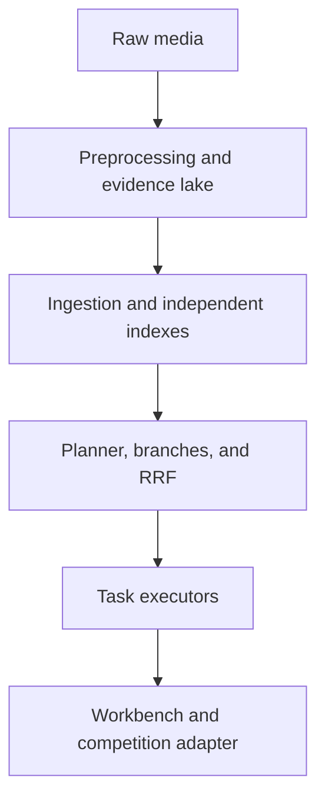
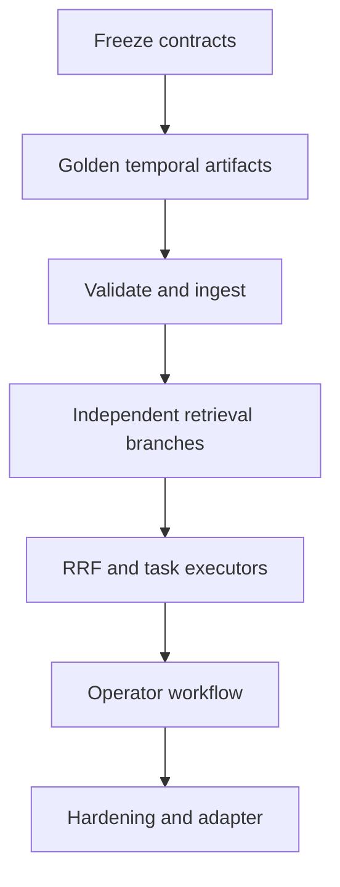

# Implementation Plan — AIC HCMC 2026 Multimodal Retrieval Assistant

**Document status:** Ready for engineering execution  
**Version:** 1.3  
**Last updated:** 2026-07-17  
**Source of truth:** `PRD.md` v2.4  
**Architecture decision:** [`docs/architecture/tech_stack.md`](docs/architecture/tech_stack.md) v1.1  
**Planning horizon:** Four implementation weeks plus a rule-driven competition-integration phase  
**Team model:** Up to five members  
**Delivery model:** Vertical slice first; benchmark-gated expansion  
**Revision summary:** v1.3 standardizes NestJS source paths, adds the ORM/pgvector gate, freezes the BullMQ→NestJS worker→Python runner contract, and pins deterministic schema/code generation.

> **Target outcome**  
> Deliver a local-first system that converts raw multimedia into versioned, multi-scale evidence; retrieves through isolated visual/OCR/ASR branches; executes task-specific Textual KIS, Video KIS, AVS, VQA, and KISC policies; presents playable evidence in an operator workbench; and keeps organizer behavior behind a disabled-by-default competition adapter.

This plan translates the PRD into sequenced engineering work. Organizer rules override this plan. Unknown submission schemas, timestamp units, authentication, timeouts, penalties, network rules, and automatic-mode behavior must remain configuration or adapter concerns.

## 1. Execution model and technical baseline

### 1.1 Delivery principles

1. Build one complete golden-fixture path before optimizing individual modules.
2. Freeze contracts before backend, frontend, and preprocessing implementations diverge.
3. Use one canonical PTS-aligned millisecond timeline with half-open intervals `[start_ms, end_ms)`.
4. Materialize `frame → micro_event → segment → context_window`; keep `segment` as the default result unit.
5. Publish modality outputs independently; fuse them only in the retrieval backend.
6. Start with visual + OCR + ASR, PostgreSQL + pgvector + FTS, a NestJS/TypeScript backend, a Python inference runtime for online PyTorch models, React/Next.js, Nginx, and Docker Compose.
7. Use RRF for the baseline candidate pool and separate task executors for final behavior.
8. Preserve temporal coverage. Quality scores route evidence; only proven technical failures are permanently invalid.
9. Make every job idempotent, resumable, observable, and reproducible by version.
10. Treat clip embeddings, CLAP, SED, captions, objects, semantic graph enrichment, and VLM reranking as benchmark-gated additions.
11. Return degraded results when an optional branch fails; never mix incompatible active versions.
12. Low confidence triggers expansion, clarification, or abstention—never silent submission.

### 1.2 Fixed architecture



| Component | Baseline implementation | Upgrade boundary |
|---|---|---|
| Preprocessing | Python 3.11+, FFmpeg/PyAV, OpenCV, PyArrow/Polars, PyTorch | Model adapters per branch |
| Evidence lake | Parquet plus immutable/versioned artifacts | Object storage URI adapter |
| Relational/catalog | PostgreSQL | None unless measured need |
| Vector retrieval | pgvector | Optional Qdrant behind interface |
| Lexical retrieval | PostgreSQL FTS/trigram | Optional OpenSearch after benchmark |
| Backend | Node.js LTS, TypeScript, NestJS, database adapter with provisional Prisma candidate, Redis/BullMQ | Service split only after bottleneck; ORM freezes only after the P0 spike |
| Online inference | Python, PyTorch/Transformers, minimal internal HTTP API | ONNX in Node.js or gRPC only after benchmark |
| Media | Nginx or equivalent HTTP Range service | Proxy/transcoding profile |
| Frontend | React/Next.js + TypeScript | Generated OpenAPI client |
| Deployment | Docker Compose, local-first safe mode | Hardware-specific profiles |
| Observability | Structured JSON logs and Prometheus-compatible metrics | Dashboard implementation |

### 1.3 Team roles and ownership

| Role | Primary ownership | Required reviews |
|---|---|---|
| R1 — Visual/Video ML | probing support, segmentation, hierarchy, sampling, quality, dedup, visual/clip models | Temporal schemas, evaluation |
| R2 — Audio/Language ML | OCR, VAD, ASR, alignment, text normalization, CLAP/SED experiments | Query planning, VQA evidence |
| R3 — Backend/Data | contracts, migrations, ingestion, indexes, planner runtime, retrieval APIs, adapter interface | All schema/API changes |
| R4 — Frontend/Operator UX | workbench, player, evidence/hierarchy UI, sessions, shortcuts, submission preview | OpenAPI and operator tests |
| R5 — Evaluation/DevOps | fixtures, judgments, metrics, CI/CD, observability, snapshots, load/failure testing | Release activation |

If fewer than five people are available, combine R1+R2 and R3+R5. Do not remove dedicated frontend/operator ownership.

### 1.4 Work streams

| Stream | Owner | Output |
|---|---|---|
| WS-A Contracts | R3, reviewed by all | JSON Schema/Pydantic/TypeScript/OpenAPI contracts |
| WS-B Temporal preprocessing | R1 | Multi-scale temporal artifacts and previews |
| WS-C Text/audio evidence | R2 | OCR/ASR artifacts and indexes |
| WS-D Ingestion/retrieval | R3 | Catalog, indexes, planner, branches, RRF, APIs |
| WS-E Operator product | R4 | Search, playback, evidence, sessions, task workflows |
| WS-F Evaluation/operations | R5 | Golden tests, query suite, gates, dashboards, snapshots |

### 1.5 Critical path



Work may run in parallel only after its input contract is frozen. Frontend implementation may use committed fixtures before live services are ready.

### 1.6 Contracts to freeze before feature work

| Contract | Minimum fields/behavior | Owner |
|---|---|---|
| `VersionManifest` | dataset, pipeline, schema, index versions; model revisions; activation state | R3/R5 |
| `Video` | stable ID, source URI, checksum, duration, PTS/stream metadata | R1/R3 |
| `Frame` | ID, PTS timestamp, segment/micro-event linkage, preview, quality, cluster | R1 |
| `MicroEvent` | ID, interval, parent segment, ordered siblings, type | R1/R3 |
| `Segment` | ID, interval, micro-events, context windows, neighbors, preview | R1/R3 |
| `ContextWindow` | ID, interval, member segments, overlap policy | R1/R3 |
| `EvidenceRecord` | ID, type, interval, parent/reference, payload, confidence, producer, provenance | R2/R3 |
| `ProcessingRun` | stage, config hash, model/code versions, state, timing, structured error | R1/R2/R3 |
| `ArtifactManifest` | URI, checksum, schema, size, run ID, publication state | R3 |
| `QueryPlan` | task, variants, concepts, constraints, temporal relations, granularities, branches, budgets, fallback | R3/R2 |
| `BranchResult` | branch, status, version, elapsed/deadline, candidates, evidence IDs, error summary | R3 |
| `SearchResponse` | task executor, versions, confidence, degraded state, branch status, results, timing | R3/R4 |
| Task outputs | Textual KIS, Video KIS, AVS, VQA, and KISC-specific response fields | R3/R4/R5 |
| `CompetitionAdapter` | capabilities, validation, conversion, submit, status; disabled by default | R3 |

Rules:

- missing scalar values use `null`; missing collections use `[]`;
- timestamps are integer milliseconds internally;
- IDs and interval semantics cannot change silently within schema v1;
- contract changes require migration notes, updated fixtures, regenerated clients, and contract tests;
- every online result carries one coherent version manifest.

### 1.7 Existing workspace and implementation placement

The current repository is the implementation boundary. Do not create alternative root `services/`, `packages/`, `ops/`, `openapi/`, or `migrations/` trees.

```text
repo/
├── .agents/
├── apps/{backend,frontend}/
├── artifacts/
├── configs/
├── contracts/{examples,schemas,versioning}/
├── data/{local_cache,samples,scratch,tmp}/
├── docs/{api,architecture,pipeline}/
├── eval/{ablation,benchmark_runs,error_analysis,ground_truth,metrics,queries}/
├── experiments/{model_tests,notebooks,retrieval_tests,sampling_tests}/
├── pipelines/
│   ├── feature_extraction/{asr,captioning,object_detection,ocr,visual_embedding}/
│   ├── fusion/{final_records,frame_mapping,modality_merging,segment_mapping}/
│   ├── ingestion/{ingestion_logs,metadata_ingestion,vector_ingestion}/
│   └── preprocessing/{deduplication,keyframe_sampling,metadata_extraction,quality_filtering,shot_detection,video_ingestion}/
└── tests/
```

| Planned module/deliverable | Required location |
|---|---|
| NestJS modules, routes, and application bootstrap | `apps/backend/src/` and `apps/backend/` |
| Database adapter, repositories, and migrations | `apps/backend/src/database/`; `apps/backend/prisma/` only if the Prisma spike passes |
| Query planner | `apps/backend/src/planner/` |
| Online branch retrieval, RRF, grouping, reranking, confidence/degradation | `apps/backend/src/retrieval/` |
| Task executors | `apps/backend/src/executors/` |
| Evidence-graph queries | `apps/backend/src/evidence/` |
| Competition adapter | `apps/backend/src/competition/` |
| Media Range/proxy endpoints | `apps/backend/src/media/` |
| Operator frontend and generated API client | `apps/frontend/` |
| Probe, segmentation/hierarchy, sampling, quality, dedup | `pipelines/preprocessing/` |
| Visual/OCR/ASR and optional extraction branches | `pipelines/feature_extraction/` |
| Offline modality alignment and fused-record publication | `pipelines/fusion/` |
| Artifact validation and DB/vector ingestion | `pipelines/ingestion/` |
| Schemas and examples | `contracts/schemas/` and `contracts/examples/` |
| Compatibility/version policy | `contracts/versioning/` |
| Generated backend contract types and frontend client | `apps/backend/src/generated/` and `apps/frontend/src/generated/` |
| Online query encoders and optional PyTorch reranking/VQA inference | `apps/inference/` |
| Golden media | `data/samples/` |
| Pipeline/index/snapshot/report outputs | `artifacts/` |
| Queries, ground truth, metrics, ablations, reports | `eval/` |
| Non-production investigations | `experiments/` |
| OpenAPI | `docs/api/internal-v1.json` |
| Architecture/runbooks/observability docs | `docs/architecture/` |
| Pipeline documentation | `docs/pipeline/` |
| Cross-module tests | `tests/{unit,contract,integration,end_to_end,golden}/` |

Minimal additions:

```text
apps/backend/src/{common,database,datasets,jobs,indexes,ingestion,retrieval,planner,executors,evidence,competition,media,sessions,health,generated}/
apps/backend/prisma/migrations/  # only if the Prisma spike passes
apps/inference/{src,tests}/
apps/frontend/{src,tests}/
apps/frontend/src/generated/
pipelines/feature_extraction/{clip_embedding,audio_embedding,sound_event_detection}/  # only when enabled
contracts/schemas/{micro_event,context_window,processing_run,artifact_manifest,version_manifest}/
contracts/schemas/{query_plan,branch_result,vqa_response,kisc_session,evidence_relation}/
contracts/versioning/compatibility_policy.md
docs/api/internal-v1.json
docs/architecture/runbooks/
configs/observability/
artifacts/{pipeline_runs,indexes,snapshots,reports}/
tests/{unit,contract,integration,end_to_end,golden}/
```

`pipelines/fusion/` owns offline alignment/publication. `apps/backend/src/retrieval/` owns live late fusion and task-aware ranking. `__pycache__/` is ignored and never treated as source structure.

### 1.8 Story readiness and completion

A story is ready only when it contains:

- owner and reviewers;
- typed inputs/outputs and compatible versions;
- fixtures or source test data;
- happy path, failure behavior, timeout/retry behavior;
- acceptance metric and required tests;
- observability fields;
- feature flag/rollback behavior when applicable.

A story is done only when:

- implementation, unit tests, contract tests, and applicable golden/integration tests pass;
- logs, metrics, structured errors, config, and producer versions exist;
- documentation and generated clients are updated;
- safe-mode behavior is verified;
- latency/storage/quality impact is recorded;
- the last known-good version remains activatable.

## 2. Phased implementation plan

### 2.1 Phase 0 — Contract freeze and golden fixture

**Duration:** 2–4 days  
**Milestone:** M0 — Contracts are executable  
**Objective:** Make preprocessing, backend, and frontend independently buildable against the same fixtures.

| ID | Work item | Owner | Depends on | Deliverable | Acceptance |
|---|---|---|---|---|---|
| P0-01 | Harden existing workspace and tooling | R3/R5 | None | Existing root structure, lockfiles, Compose, ignore rules, lint/test commands | Clean clone runs contract test shell; no parallel root architecture |
| P0-02 | Freeze identity/time/version rules | R3/R1 | P0-01 | ID specification and `VersionManifest` | Cross-language fixtures use identical IDs/intervals |
| P0-03 | Define temporal-node schemas | R1/R3 | P0-02 | `contracts/schemas/{frame,micro_event,segment,context_window}/` | Containment/adjacency validator passes |
| P0-04 | Define evidence/run/artifact schemas | R2/R3 | P0-02 | New schemas under `contracts/schemas/` | Null/empty and provenance fixtures pass |
| P0-05 | Define online contracts | R3/R4 | P0-02 | `query_plan`, `branch_result`, `search_response`, task schemas | Pydantic, JSON Schema, TypeScript agree |
| P0-06 | Commit OpenAPI and generated client | R3/R4 | P0-05 | `docs/api/internal-v1.json`, client under `apps/frontend/` | Mock frontend calls compile |
| P0-07 | Build golden media fixture | R1/R2/R5 | P0-01 | 2–5 min fixture under `data/samples/` | Fixture checksum manifest committed |
| P0-08 | Build expected golden artifacts | R1/R2/R5 | P0-03/04/07 | `contracts/examples/` plus golden files under `artifacts/` | Validators and snapshot tests pass |
| P0-09 | Configure CI baseline | R5 | P0-01/05 | Lint, type, unit, contract, schema checks | Required checks run on every change |
| P0-10 | Open organizer decision register | Team lead/R5 | PRD | Owner/status/fallback for every blocker | No organizer assumption is hard-coded |
| P0-11 | Run ORM/pgvector migration spike | R3/R5 | P0-01/02 | Prisma candidate report covering vector DDL/query, transactions, forward/rollback migrations | Prisma is accepted explicitly or replaced behind the database adapter |
| P0-12 | Freeze batch-job runner contract | R3/R1/R5 | P0-02/04 | BullMQ job envelope, Python NDJSON events, cancellation, timeout, artifact-completion contract | Node worker launches fixture CLI; Python never consumes BullMQ directly |
| P0-13 | Implement deterministic contract codegen | R3/R4 | P0-03/04/05 | Pinned JSON Schema→Pydantic/TypeScript/Ajv/OpenAPI 3.1 toolchain defined in `tech_stack.md` | Clean regeneration produces no diff; invalid fixtures fail in both runtimes |

**M0 exit gate**

- [ ] Canonical IDs, milliseconds, half-open intervals, and four temporal levels are approved.
- [ ] Python and TypeScript contract fixtures pass.
- [ ] OpenAPI client generation is reproducible.
- [ ] Golden media and expected evidence are versioned.
- [ ] Frontend renders a mock segment/evidence response.
- [ ] CI blocks invalid schema or contract changes.
- [ ] The ORM decision is recorded with pgvector and rollback evidence.
- [ ] The NestJS worker→Python runner fixture passes success, timeout, cancellation, and retry tests.
- [ ] Contract and client generation is deterministic from a documented canonical source.

### 2.2 Phase 1 — Temporal evidence foundation and ingestion

**Duration:** Week 1  
**Milestone:** M1 — Retrieval-ready evidence can be rebuilt and played  
**Objective:** Process media into validated multi-scale artifacts and ingest them without model-heavy dependencies.

| ID | Work item | Owner | Depends on | Deliverable | Acceptance |
|---|---|---|---|---|---|
| P1-01 | Dataset manifest/checksum ingest | R1/R3 | M0 | Idempotent source catalog | Rename/content-change/corrupt tests pass |
| P1-02 | Probe and PTS normalization | R1 | P1-01 | Stream/rotation/VFR metadata | Seek accuracy within one frame or 100 ms |
| P1-03 | Video-type classifier | R1 | P1-02 | Edited/continuous/screen/uncertain route | Config override and fallback work |
| P1-04 | Multi-scale segmentation | R1 | P1-03 | Micro-events, segments, context windows | Full valid timeline coverage; hierarchy valid |
| P1-05 | Coverage-safe sampling | R1 | P1-04 | Candidate frames and selection provenance | Every segment has preview; gap budget passes |
| P1-06 | Quality tiering and dedup clusters | R1 | P1-05 | Scores, tiers, clusters, representatives | Low quality is retained unless technically invalid |
| P1-07 | Preview and proxy generation | R1/R3 | P1-02/05 | WebP previews and range-seekable proxy | Browser seeks correct interval |
| P1-08 | Artifact publisher/run manifests | R3 | P1-04/05/06 | Atomic versioned runs under `artifacts/pipeline_runs/` | Interrupted publication is not activated |
| P1-08A | NestJS batch worker and Python runner | R3/R1 | P0-12/P1-01 | `apps/backend/src/jobs/` worker/runner adapter plus Python CLI event publisher | Job success, retry, timeout, cancellation, bounded logs, and invalid-path tests pass |
| P1-09 | PostgreSQL schema and migrations | R3 | M0/P0-11 | Selected adapter and migrations under `apps/backend/`; Prisma paths are used only if its spike passes | Upgrade/downgrade test on fixture DB |
| P1-10 | Ingestion validator/upsert | R3 | P1-08/09 | Implementation under `pipelines/ingestion/` | Repeat ingest is idempotent; bad rows quarantined |
| P1-11 | Index manifest/activation shell | R3/R5 | P1-10 | Staged/active version records | Incompatible activation is rejected |
| P1-12 | Media/evidence vertical-slice APIs | R3 | P1-07/10 | Segment, hierarchy, evidence, neighbors, media endpoints | Fixture result is playable end to end |

**M1 exit gate**

- [ ] Golden fixture and at least 10 available dataset hours process reproducibly.
- [ ] All frame/micro-event/segment/context-window relations pass integrity checks.
- [ ] One corrupt source does not stop the batch.
- [ ] Jobs resume from valid checkpoints.
- [ ] Only NestJS workers consume BullMQ; Python processes are owned, bounded, and observable children or runner-adapter targets.
- [ ] Artifact and database versions agree.
- [ ] Every fixture segment returns a playable source/proxy interval.
- [ ] Index/catalog rebuild does not require source re-decoding.

### 2.3 Phase 2 — Retrieval backend and core evidence branches

**Duration:** Week 2  
**Milestone:** M2 — Versioned hybrid retrieval baseline  
**Objective:** Deliver visual + OCR + ASR candidate generation, structured planning, RRF, degraded results, and measurable quality.

| ID | Work item | Owner | Depends on | Deliverable | Acceptance |
|---|---|---|---|---|---|
| P2-01 | Visual embedding adapter/benchmark | R1/R5 | M1 | `pipelines/feature_extraction/visual_embedding/` and `experiments/model_tests/` | Winner chosen by retrieval/cost report |
| P2-02 | Visual vector index/branch | R1/R3 | P2-01 | Index ingestion in `pipelines/ingestion/vector_ingestion/`; query branch in `apps/backend/src/retrieval/` | Query encoder/index compatibility passes |
| P2-03 | High-resolution OCR extraction | R2 | M1 | `pipelines/feature_extraction/ocr/` outputs | Vietnamese raw text and diacritics preserved |
| P2-04 | OCR temporal tracking/indexes | R2/R3 | P2-03 | Offline tracks plus backend lexical/semantic branch | Track and lexical query fixtures pass |
| P2-05 | Audio/VAD/chunk pipeline | R2 | M1 | `pipelines/feature_extraction/asr/` audio/chunk stages | Long audio resumes per chunk |
| P2-06 | ASR and optional alignment | R2 | P2-05 | Timestamped ASR outputs under the ASR branch | Interval mapping and WER/CER sample report |
| P2-07 | ASR lexical/semantic branch | R2/R3 | P2-06 | Ingestion plus `apps/backend/src/retrieval/` ASR query branch | Phrase and entity fixtures pass |
| P2-08 | Deterministic query planner | R3/R2 | M0 | `apps/backend/src/planner/` | Golden plans and override tests pass |
| P2-09 | Branch runtime isolation | R3/R5 | P2-02/04/07/08 | `apps/backend/src/retrieval/` deadlines, queues, bulkheads, circuits | Forced branch failure does not cascade |
| P2-10 | RRF and temporal grouping | R3/R5 | P2-09 | Provenance-rich candidate pool | Deterministic ranking tests pass |
| P2-11 | Confidence/fallback envelope | R3/R5 | P2-10 | Confidence state and ordered fallback controller | Expand/clarify/abstain fixtures pass |
| P2-12 | Search/plan/status APIs | R3 | P2-08/09/10/11 | `/search`, `/search/plan`, `/branches/status` | OpenAPI contract and load smoke tests pass |
| P2-13 | Build initial 100-query suite | R5 + all | M1 | `eval/queries/` and `eval/ground_truth/` | Queries and ground-truth intervals reviewed |
| P2-14 | Baseline benchmark report | R5 | P2-12/13 | `eval/benchmark_runs/` report | Visual+OCR+ASR compared with visual-only |

**M2 exit gate**

- [ ] Visual, OCR, and ASR artifacts can be rerun independently.
- [ ] Query plans and branch results are inspectable and versioned.
- [ ] RRF returns evidence provenance and correct temporal grouping.
- [ ] Failure of any optional branch returns a contract-valid degraded response.
- [ ] No response mixes incompatible dataset/pipeline/schema/index versions.
- [ ] KIS Recall@10 and P95 first-result latency are recorded.
- [ ] P95 first result is below one second or a mitigation is approved.

### 2.4 Phase 3 — Operator frontend and task-specific executors

**Duration:** Week 3  
**Milestone:** M3 — All task workflows are usable  
**Objective:** Turn the shared candidate pool into task-correct results and a fast operator workflow.

| ID | Work item | Owner | Depends on | Deliverable | Acceptance |
|---|---|---|---|---|---|
| P3-01 | Workbench shell and API client | R4 | M0/M2 | `apps/frontend/` query bar, filters, task state | Runs against mock and live API |
| P3-02 | Result grid/contact sheet | R4 | P3-01 | Dense results, scores, evidence chips, feedback | Stable partial-result updates |
| P3-03 | Player/timeline/hierarchy | R4/R3 | P3-01/M1 | Precise seek, context expansion, neighbors, overlays | Operator reaches exact interval by keyboard |
| P3-04 | Evidence/confidence/degradation inspector | R4 | P3-02/M2 | Branch status, provenance, versions, fallback display | Missing branch never appears as supporting evidence |
| P3-05 | Textual KIS executor | R3/R5 | M2 | `apps/backend/src/executors/` exact ranking, temporal NMS, refinement | KIS metrics and output contract pass |
| P3-06 | Video KIS executor | R1/R3/R4 | M2 | Backend executor plus frontend description/facet/cluster flow | Description path works with similarity disabled |
| P3-07 | AVS executor | R3/R5 | M2 | Backend relevance + MMR/cluster/temporal diversity | Diversity improves without unacceptable relevance loss |
| P3-08 | Session persistence | R3/R4 | P3-01 | Query/refinement/view/reject/select history | Backtracking preserves state |
| P3-09 | KISC clarification policy | R3/R5 | P3-08/P2-08 | Candidate-partition/information-gain questions | Questions are answerable from indexed facets |
| P3-10 | VQA evidence executor | R2/R3 | M2 | Retrieve→expand→collect→verify bundle | Returns evidence or `needs_more_evidence` |
| P3-11 | Deterministic VQA tools | R1/R2/R3 | P3-10 | Count/order/duration utilities over tracks/intervals | Tool results link to evidence intervals |
| P3-12 | Submission preview shell | R3/R4 | P3-05/06/07 | Disabled adapter validation/payload preview | No live submit capability is enabled |
| P3-13 | Timed operator rehearsal | R4/R5 | P3-01..12 | Scenario results and UX issues | Time-to-first-correct and error log recorded |

**M3 exit gate**

- [ ] Operator completes Textual KIS, Video KIS description, and AVS flows.
- [ ] VQA returns evidence-linked output or abstains.
- [ ] KISC preserves history and reduces candidates with valid facets.
- [ ] Low confidence expands, clarifies, or abstains without submitting.
- [ ] Frontend shows version, confidence, and degraded state accurately.
- [ ] Adapter absence does not block search, playback, VQA, or KISC.

### 2.5 Phase 4 — Evidence graph, resilience, and benchmark-gated upgrades

**Duration:** Week 4  
**Milestone:** M4 — Hardened qualification candidate  
**Objective:** Add relations required for temporal reasoning, prove recovery behavior, and activate only upgrades that pass cross-task gates.

| ID | Work item | Owner | Depends on | Deliverable | Acceptance |
|---|---|---|---|---|---|
| P4-01 | Core temporal graph | R1/R3 | M1 | Offline relations plus `apps/backend/src/evidence/` queries | Reconstruct hierarchy without reading media |
| P4-02 | Entity/evidence relations | R2/R3 | M2 | Evidence-relation artifacts and backend traversal | Invalid/cross-version edges rejected |
| P4-03 | Object/OCR tracks | R1/R2 | M2 | Benchmark-gated temporal tracks | VQA/AVS gain and cost measured |
| P4-04 | Blue/green index activation | R3/R5 | M2 | Stage, smoke-test, activate, rollback | Failed activation keeps previous index |
| P4-05 | Snapshot/restore runbook | R5/R3 | P4-04 | `artifacts/snapshots/` plus `docs/architecture/runbooks/` | Recovery time measured in offline rehearsal |
| P4-06 | Load/backpressure/failure tests | R5/R3 | M2 | P50/P95/P99, queues, circuit recovery | No cascading failure under defined load |
| P4-07 | Safe-mode deployment | R5 | M3 | Network-disabled Docker Compose profile | End-to-end workflow runs offline |
| P4-08 | Cross-task release gates | R5 | M3 | Automated matrix under `eval/metrics/` and `eval/benchmark_runs/` | Failing task blocks activation |
| P4-09 | Clip embedding experiment | R1/R5 | M2 | InternVideo2 or benchmarked alternative branch | Image+clip ablation passes gate or remains disabled |
| P4-10 | Non-speech audio experiment | R2/R5 | M2 | CLAP branch; optional SED experiment | Audio query gain justifies cost |
| P4-11 | Caption/object experiment | R1/R2/R5 | M2 | Selected-frame/segment evidence branches | No material hallucination/regression |
| P4-12 | Top-K reranking experiment | R1/R3/R5 | M3 | Optional reranker on top 10–20 | Latency/quality gates pass |
| P4-13 | Final timed rehearsal | All | P4-01..12 | Qualification-candidate report | M4 checklist and rollback plan approved |

Experiment priority:

1. DINOv3 dedup/diversity;
2. InternVideo2 clip embeddings;
3. CLAP non-speech retrieval;
4. multi-granularity captions;
5. YOLO-World selected-frame evidence;
6. optional SED;
7. query-aware selection/temporal refinement;
8. top-K reranker;
9. learned/dynamic fusion.

An experiment that does not pass its gate remains disabled and must not delay M4.

**M4 exit gate**

- [ ] Hierarchy/adjacency/evidence relations pass referential integrity.
- [ ] Branch isolation, circuit recovery, blue/green activation, rollback, and restore are rehearsed.
- [ ] Safe mode runs with external network disabled.
- [ ] Every active optional branch has an ablation and rollback path.
- [ ] All hard per-task, latency, robustness, privacy, and version-coherence gates pass.
- [ ] Last known-good deployment and index snapshot are documented.

### 2.6 Phase 5 — Competition integration

**Timing:** Starts only after authoritative organizer contracts are available  
**Milestone:** M5 — Competition-compatible candidate  
**Objective:** Implement organizer-specific behavior without changing internal retrieval contracts.

| ID | Work item | Owner | Depends on | Deliverable | Acceptance |
|---|---|---|---|---|---|
| P5-01 | Update organizer decision register | Team lead/R5 | Official rules | Confirmed schema/network/hardware/protocol values | Every blocker has source/status/date |
| P5-02 | Adapter capabilities/config | R3 | P5-01 | Supported tasks, auth, limits, units, result counts | No values hard-coded outside adapter/config |
| P5-03 | Identifier/timestamp conversion | R3/R5 | P5-02 | Internal→organizer mapping | Boundary/rounding fixtures pass |
| P5-04 | Task payload validation | R3/R5 | P5-02 | KIS/AVS/VQA/automatic payloads as applicable | Organizer examples pass locally |
| P5-05 | Authentication/rate/retry/status | R3/R5 | P5-02 | Safe client with idempotency where supported | Mock server failure tests pass |
| P5-06 | Hardware/network deployment profile | R5 | P5-01/M4 | Final Compose/config/runbook | Runs within official restrictions |
| P5-07 | Non-submitting dry run | All | P5-03..06 | End-to-end payload preview and trace | No external submit invoked |
| P5-08 | Human-confirmed submit enablement | Team lead/R3/R4 | Compliance approval | Explicit review/confirm flow | Cannot submit without confirmation |
| P5-09 | Automatic mode | R3/R5 | Explicit official requirement | Separate feature-flagged path | Disabled otherwise |

### 2.7 First implementation backlog

Create these issues first, in this order:

1. `CONTRACT-001` — Canonical ID and interval specification.
2. `CONTRACT-002` — VersionManifest and compatibility policy.
3. `CONTRACT-003` — Temporal-node schemas and validators.
4. `CONTRACT-004` — Evidence/run/artifact schemas.
5. `CONTRACT-005` — QueryPlan, BranchResult, SearchResponse, task outputs.
6. `FIXTURE-001` — Golden media and checksum manifest.
7. `FIXTURE-002` — Golden Parquet/JSON/evidence responses.
8. `PLATFORM-001` — Existing workspace tooling, lockfiles, Compose, ignore rules, CI.
9. `PLATFORM-002` — ORM/pgvector migration spike and decision.
10. `PLATFORM-003` — NestJS BullMQ worker and typed Python runner contract.
11. `PLATFORM-004` — Deterministic contract/code-generation toolchain.
12. `PRE-001` — Manifest/checksum ingest.
13. `PRE-002` — Probe/PTS normalization.
14. `PRE-003` — Multi-scale temporal hierarchy.
15. `DATA-001` — PostgreSQL schema and migrations through the selected adapter.
16. `DATA-002` — Artifact validator and idempotent ingest.
17. `MEDIA-001` — Range media and preview endpoints.
18. `API-001` — Segment/hierarchy/evidence endpoints.
19. `UI-001` — Mock workbench vertical slice.
20. `EVAL-001` — Contract/golden test runner.
21. `OPS-001` — Structured logs, metrics, and active-version endpoint.

### 2.8 Dependency and parallelization map

| After | Can run in parallel |
|---|---|
| Contracts frozen | Temporal preprocessing, DB migrations, frontend mock UI, golden query design |
| Golden temporal artifacts | Artifact ingestion, media APIs, preview UI, preprocessing integration tests |
| DB/index shell ready | Visual/OCR/ASR index implementations |
| Branch envelopes ready | Planner, branch runtime isolation, RRF tests, branch-status UI |
| RRF pool ready | Textual KIS, Video KIS, AVS executors; VQA/KISC contracts |
| Session APIs ready | KISC policy and frontend history/backtracking |
| M3 complete | Evidence graph, optional branches, reranking, load/failure tests |

## 3. Engineering controls, verification, and release

### 3.1 Branch and change policy

- Keep changes small and mapped to one issue ID.
- Any schema/OpenAPI change requires contract-owner review.
- Any migration requires forward and rollback tests on fixture data.
- Any model/index change requires model revision, config hash, benchmark result, and rollback reference.
- Generated code may not mutate source media or active indexes directly.
- Secrets, organizer URLs, and credentials never enter source control.
- External model APIs remain disabled in `aic2026-safe`.

### 3.2 CI pipeline

Run in this order:

1. formatting and lint;
2. Python/TypeScript type checks;
3. JSON Schema/Pydantic/TypeScript contract equivalence;
4. OpenAPI generation/diff and client compilation;
5. unit tests;
6. Parquet/schema/temporal-integrity tests;
7. database migration tests;
8. golden preprocessing and ingestion tests;
9. retrieval/executor contract tests;
10. degraded/fallback/circuit-breaker tests;
11. safe-mode network-denial test;
12. benchmark and load jobs on scheduled/manual runners.

PR checks must not depend on full-dataset processing. Full benchmarks run on controlled hardware with retained run manifests.

### 3.3 Required test matrix

| Layer | Required cases |
|---|---|
| Media | VFR, rotation, corrupt file, missing audio, unusual codec, seek accuracy |
| Temporal | Edited cuts, continuous footage, static interval, short event, overlap, boundary event |
| Sampling/quality | Dark, blurred, flat-color, OCR-rich, motion-rich, duplicate with changed OCR |
| OCR | Vietnamese diacritics, no-diacritic search, small text, repeated text track |
| ASR | Long audio, silence, overlap, Vietnamese phrase, mixed language, chunk resume |
| Retrieval | Visual-only, OCR-only, ASR-only, multimodal agreement/conflict, no results |
| Planner | Task override, wrong inference fallback, hard versus soft constraints, temporal/count queries |
| Executors | Exact KIS, description Video KIS, diverse AVS, VQA evidence/abstention, KISC refinement |
| Resilience | Branch timeout, index unavailable, circuit open/recover, stale version, DB restart |
| Operations | Index activation failure, rollback, snapshot restore, offline deployment |
| Adapter | Unit conversion, ID mapping, auth failure, rate limit, duplicate submit prevention |

### 3.4 Evaluation and release gates

Maintain at least 100 initial judged queries:

- 25 object/action/scene KIS;
- 15 OCR KIS;
- 15 ASR KIS;
- 10 multi-scene/temporal KIS;
- 15 AVS concepts;
- 15 VQA questions;
- 5 KISC scenarios;
- add non-speech audio queries before enabling CLAP/SED.

| Gate | Hard failure condition |
|---|---|
| Contracts | Schema, OpenAPI, client, or version compatibility fails |
| Textual KIS | Material Recall/MRR/timestamp regression beyond approved tolerance |
| Video KIS | Material similarity/description or operator-navigation regression |
| AVS | Relevance/diversity/duplicate regression beyond tolerance |
| VQA | Evidence recall, answer accuracy, support, or abstention regression |
| KISC | Success, candidate reduction, correction rate, or turn regression |
| Latency | P95 budget exceeded without approved mitigation |
| Robustness | Single optional-branch failure invalidates request or cascades |
| Versioning | Response mixes incompatible versions |
| Privacy/compliance | Safe-mode network or data handling rule fails |
| Operations | Index rollback or snapshot restore fails |

A higher aggregate score cannot override a hard task-specific failure.

### 3.5 Observability specification

Every preprocessing stage records:

- run/stage/video IDs, versions, config hash, model revision;
- start/end, elapsed, attempts, checkpoint, recoverability;
- throughput, CPU/GPU time, memory, artifact size;
- frame retention, tier and cluster ratios;
- structured error code and redacted context.

Every query records:

- request/session/task/executor IDs;
- query-plan summary and selected branches;
- active versions;
- per-branch status, elapsed, candidates, contribution, circuit state;
- fusion/grouping/reranking timing;
- confidence bin and fallback stages;
- degraded state and unavailable branches;
- operator views/feedback/time-to-first-correct when enabled;
- adapter preview/submit events without secrets or sensitive transcript logging.

### 3.6 Deployment and recovery

Maintain three profiles:

| Profile | Purpose | Network |
|---|---|---|
| `dev` | Fixtures, hot reload, mock models/adapters | Developer-controlled |
| `benchmark` | Reproducible model/index experiments | Restricted and recorded |
| `aic2026-safe` | Qualification/final rehearsal | External network disabled |

Required runbooks:

- process new dataset version;
- retry/quarantine failed media;
- rebuild/stage/activate/rollback index;
- restore PostgreSQL, vector indexes, artifacts, and version manifest;
- start degraded visual-only or visual+text mode;
- rotate credentials/configure adapter;
- execute timed operator rehearsal;
- delete a dataset version and derived artifacts when required.

### 3.7 Performance budgets

These are engineering targets, not organizer rules:

| Operation | Initial budget |
|---|---:|
| Core branch retrieval P95 | <500 ms per branch |
| First result P95 | <1 second |
| Fused baseline P95 | <1.5 seconds |
| Optional reranking | Separate 2–5 second budget or asynchronous |
| Preview seek error | ≤ one source frame or 100 ms |
| Valid-video completion | ≥99% without manual intervention |

Each branch receives an explicit deadline, top-K, queue, and concurrency budget. Optional work cannot consume the capacity reserved for core visual/OCR/ASR retrieval.

### 3.8 Risk control actions

| Risk | Preventive action | Recovery |
|---|---|---|
| One segmentation policy fails | Multi-scale edited/continuous paths and override | Reprocess segmentation-dependent stages only |
| Hard filtering loses target | Soft tiers and coverage guarantee | Search fallback/secondary members |
| OCR/ASR noise | Raw+normalized forms, lexical+semantic indexes | Expand variants and context |
| Optional model outage | Bulkhead, deadline, circuit breaker | Degraded result from healthy branches |
| Model/index incompatibility | Version manifest and activation validation | Roll back active index |
| Low confidence | Ordered fallback policy | Clarify or abstain |
| VQA hallucination | Evidence-only context, deterministic tools, verification | `needs_more_evidence` |
| Storage growth | Shards, references, measured budgets, representative selection | Disable nonessential artifacts/rebuild |
| Operator latency | Contact sheet, shortcuts, cached previews | Degraded core workflow |
| Unknown organizer protocol | Disabled adapter and decision register | Implement isolated adapter after rules |

### 3.9 Organizer-dependent blockers

Track each as `unknown`, `provisional`, or `confirmed`, with owner, source, date, fallback, and code impact:

- dataset size, codecs, duration, source types, and change between rounds;
- organizer-provided features and regeneration permissions;
- dataset license, privacy, retention, deletion, and external-processing rules;
- required result IDs, timestamp units, point/interval semantics, and result counts;
- query timeout, scoring, and false-submission penalties;
- VQA answer format and normalization;
- automatic-mode protocol, authentication, URLs, rate limits, retries, and traces;
- internet, cloud/API, external web/image-search, and Video KIS capture permissions;
- final hardware/network restrictions.

### 3.10 Final readiness checklist

#### Data and preprocessing

- [ ] Complete available dataset processes with resumable jobs.
- [ ] Edited and continuous footage use correct temporal paths.
- [ ] Timeline/context coverage and hierarchy integrity pass.
- [ ] Quality uses soft tiers; only technical invalidity is hard dropped.
- [ ] Visual/OCR/ASR evidence aligns to canonical intervals.
- [ ] Indexes rebuild from artifacts without source re-decode.

#### Backend and tasks

- [ ] QueryPlan, BranchResult, SearchResponse, and task contracts pass.
- [ ] Visual/OCR/ASR branches are independent and observable.
- [ ] RRF, temporal grouping, confidence, fallback, and degraded response pass.
- [ ] Textual KIS, Video KIS, AVS, VQA, and KISC executors pass task gates.
- [ ] No response mixes incompatible versions.

#### Frontend and operations

- [ ] Search→inspect→play→refine→preview workflow works by keyboard.
- [ ] Evidence, confidence, versions, and missing branches are visible.
- [ ] Safe-mode deployment runs offline.
- [ ] Index rollback and snapshot restore are rehearsed.
- [ ] Timed operator rehearsal results are recorded.

#### Competition boundary

- [ ] Organizer decision register is current.
- [ ] Adapter remains disabled until authoritative contracts exist.
- [ ] Payload preview validates without submitting.
- [ ] Live submission requires explicit human confirmation.
- [ ] Automatic submission remains disabled unless expressly required and permitted.

### 3.11 Immediate next actions

1. Create issues `CONTRACT-001` through `CONTRACT-005` and assign R3 as contract owner.
2. Produce the golden media fixture and checksum manifest in parallel.
3. Harden the existing repository, Docker Compose, CI, ignore rules, and generated-client workflow without creating parallel root trees.
4. Freeze temporal, evidence, version, planner, branch, response, and task schemas.
5. Implement the mock workbench and first multi-scale artifact validator.
6. Start Phase 1 only after M0 contract fixtures pass.

---

**Implementation decision:** protect the critical path—contracts → temporal evidence → ingestion → isolated branches → RRF → task executors → operator workflow → hardening → competition adapter. Optional models must never delay the visual/OCR/ASR baseline or weaken the safe, recoverable, version-coherent system.
