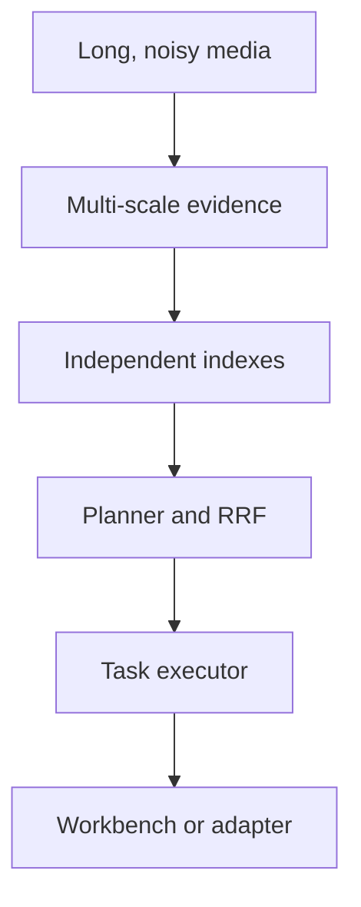

# System Problem Statement — AIC HCMC 2026 Multimodal Retrieval Assistant

**Status:** Architecture baseline  
**Version:** 1.1  
**Last updated:** 2026-07-17  
**Aligned with:** [`PRD.md`](../../PRD.md) v2.4 and [`implementation_plan.md`](../../implementation_plan.md) v1.3  
**Vietnamese companion:** [`problem_statement.vi.md`](problem_statement.vi.md)  
**Audience:** Product, AI/ML, data, backend, frontend, evaluation, and competition operations

> **In one sentence**  
> The system turns long, noisy multimedia into timestamp-accurate, explainable evidence so an operator or automated client can find, verify, and return the right moment, example set, or grounded answer under competition time constraints.

## 1. Problems the system solves

### 1.1 Search over long, unstructured multimedia

Competition media is not a searchable document collection. Useful evidence may appear briefly in a frame, persist across a clip, be spoken in audio, be written on a sign, or emerge only from the order of several events. Manually watching the full collection is too slow, while treating each video as one item is too coarse.

The system solves this by converting source media into a navigable temporal hierarchy:

`frame → micro-event → segment → context window`

The default search result is a segment: small enough to locate a target precisely, but large enough to retain useful context. Neighboring units remain available for expansion when the event crosses a boundary.

### 1.2 Precise temporal localization

Finding the correct video is insufficient. KIS and evidence-grounded tasks require the correct moment, with a timestamp that can be played, inspected, and submitted. Variable frame rates, inaccurate seeking, inconsistent timestamp units, and lost frame-to-segment mappings can all produce a visually plausible but invalid result.

The system maintains one presentation-timestamp-aligned timeline. Every artifact uses integer milliseconds and a half-open interval `[start_ms, end_ms)`. Frames, transcripts, text tracks, objects, captions, sound events, and result previews preserve their source mapping and provenance.

### 1.3 Evidence split across modalities

A query may be answerable through several independent signals:

- a visual scene, object, action, color, or place;
- visible text such as a shop name, sign, jersey number, or screen;
- speech mentioning a person, location, or event;
- a non-speech sound such as music, traffic, an alarm, or applause;
- a generated caption or a relationship between several moments.

No single embedding captures all of these reliably. The system creates independent visual, OCR, ASR, caption, object, and optional non-speech-audio evidence branches. The backend searches only the branches relevant to the query, combines their ranked candidates with reciprocal rank fusion (RRF), and retains the supporting evidence for inspection.

### 1.4 Short events and continuous footage

Edited videos and continuous or egocentric recordings behave differently. Shot-boundary detection works well for cuts but can produce one very long shot in continuous footage. Fixed-rate sampling is cheap but may miss a short decisive event. Aggressive blur, darkness, or duplicate filtering can remove the only valid evidence.

The system therefore supports multiple segmentation signals and coverage-safe sampling. Quality and duplication usually become scores, clusters, or routing features rather than hard deletion rules. Expensive models run selectively after lightweight probing and candidate selection.

### 1.5 Ambiguous, multilingual, and temporal queries

Queries may be Vietnamese, English, or mixed-language; contain misspellings; refer to text visible in the scene; describe events indirectly; or express temporal relations such as “before,” “after,” and “while.” The user may also provide a target clip instead of a complete text description.

The query planner normalizes the input and produces a structured plan containing task type, query variants, concepts, constraints, temporal relations, required granularities, retrieval branches, budgets, and fallback behavior. Low confidence can trigger query expansion, neighborhood inspection, or clarification instead of an unsupported answer.

### 1.6 Different tasks require different final behavior

A universal ranking policy would optimize the wrong outcome for at least some competition tasks. The system shares preprocessing and candidate generation, then delegates final behavior to a task-specific executor.

| Task | Problem to solve | Required system behavior | Useful output |
|---|---|---|---|
| Textual KIS | Locate one exact moment from a natural-language description | Prioritize precision, temporal accuracy, and evidence strength | A small ranked list of playable segments |
| Video KIS | Recover a target moment from a shown example clip | Combine visual similarity with facets, clusters, and temporal browsing | Similar segments and nearby context |
| AVS | Find many valid examples of a semantic concept | Balance relevance, coverage, and diversity; suppress temporal and cluster duplicates | A diverse set of qualifying segments |
| VQA | Answer a question about the media | Retrieve sufficient temporal evidence before generating or extracting an answer | A concise answer with supporting segments and provenance |
| KISC | Resolve an underspecified target through conversation | Preserve session state, expose searchable facets, and ask discriminative clarifications | A progressively narrowed candidate set |

### 1.7 Live operator constraints

During a competition, the operator must understand results quickly. A technically relevant result is not useful if it cannot be previewed, compared with neighbors, or converted into a valid submission before the time limit.

The workbench solves this operational problem with fast search, playable previews, evidence chips, result comparison, temporal neighborhood navigation, keyboard controls, session refinement, and a reviewable submission preview. The frontend consumes stable APIs and never requires direct database access.

### 1.8 Reliability and reproducibility

Multimodal pipelines are expensive and failure-prone. A decoder error, unavailable model, branch timeout, schema mismatch, or partially rebuilt index must not corrupt the collection or make every query fail. Results also need to be reproducible across experiments and releases.

The system addresses this with immutable source media, typed contracts, deterministic identifiers, idempotent and resumable stages, checksummed artifacts, explicit processing runs, compatible version manifests, independent indexes, per-branch timeouts, and circuit breakers. An optional branch failure returns a valid degraded response from healthy branches. Every response identifies one coherent dataset, pipeline, schema, and index version.

### 1.9 Unknown competition integration

The organizer's final dataset contract, scoring rules, result schema, timestamp unit, authentication, rate limits, timeout, penalties, deployment restrictions, and automatic-mode protocol are not yet fixed in the project baseline. Hard-coding assumptions would make the core system fragile.

The system uses an internal canonical contract and isolates organizer-specific behavior behind a disabled-by-default `CompetitionAdapter`. The adapter validates capabilities, converts identifiers and timestamps, builds organizer payloads, and handles submission or status calls without changing retrieval logic.

## 2. How the architecture addresses the problems

| System capability | Problem addressed | Primary workspace owner | Resulting guarantee |
|---|---|---|---|
| Probe, metadata extraction, and canonical timestamps | Unreliable media metadata and seeking | `pipelines/preprocessing/metadata_extraction/`, `video_ingestion/` | All later artifacts share one source-aligned timeline |
| Shot detection plus temporal hierarchy | Edited and continuous media need different boundaries | `pipelines/preprocessing/shot_detection/` and related preprocessing modules | Complete temporal coverage at several granularities |
| Coverage-safe keyframe sampling | Fixed sampling misses short events | `pipelines/preprocessing/keyframes/sampling.py` | Every valid visual segment keeps a preview and candidate evidence |
| Soft quality scoring and modality-aware deduplication | Hard filtering destroys rare evidence | `pipelines/preprocessing/keyframes/{quality,dedup,structural}.py` | Cost reduction without silently removing temporal coverage |
| OCR, ASR, caption, object, and visual extraction | Evidence is split across modalities | `pipelines/feature_extraction/` | Searchable, provenance-rich evidence records per modality |
| Offline temporal alignment and publication | Modality outputs have different time spans | `pipelines/fusion/` | Evidence is mapped to frames, segments, and context windows |
| Validation and versioned ingestion | Partial or incompatible outputs corrupt indexes | `pipelines/ingestion/`, `contracts/` | Only contract-valid, compatible artifacts become searchable |
| Structured query planning | Queries vary by language, task, and constraint | `apps/backend/src/planner/` | Retrieval work is explicit, bounded, and inspectable |
| Isolated branches and RRF candidate pooling | No branch is reliable enough alone | `apps/backend/src/retrieval/` | Robust candidate recall with independent failure handling |
| Task-specific executors | KIS, AVS, VQA, and KISC have different objectives | `apps/backend/src/executors/` | Final ranking and output match the requested task |
| Evidence bundles and confidence handling | Generated answers may be unsupported | `apps/backend/src/evidence/`, executors | Answers expose evidence; uncertainty triggers fallback or abstention |
| Keyboard-first operator workbench | Live review and submission are time-sensitive | `apps/frontend/` | Search, verification, refinement, and preview form one workflow |
| Replaceable competition adapter | Organizer rules remain uncertain | `apps/backend/src/competition/` | Core retrieval remains stable when the external protocol changes |

The essential boundary is that `pipelines/fusion/` performs offline evidence alignment and publication, while `apps/backend/src/retrieval/` performs live branch retrieval, late fusion, grouping, and ranking. This prevents preprocessing assumptions from becoming hard-coded online behavior.

### Representative problem flows

**A text-and-speech clue:** The query mentions a spoken destination and a visible bus number. The planner activates ASR, OCR, and visual branches. RRF pools candidates, the Textual KIS executor prioritizes segments supported by both text modalities, and the operator opens the exact interval with neighboring context.

**A brief action in continuous footage:** The target action occurs between fixed sampling points and without a scene cut. Motion or novelty signals create a micro-event, coverage-safe sampling preserves a representative frame, and temporal expansion gives the executor enough context to localize the event.

**A broad semantic request:** AVS asks for many examples of people using umbrellas. The system retrieves relevant candidates, groups overlapping intervals and near duplicates, then returns a diverse result set rather than many adjacent frames from one event.

**A question requiring order:** VQA asks what happened after a person entered a shop. The system retrieves the entry event, traverses later micro-events or segments in the same context window, and returns an answer grounded in those ordered intervals.

## 3. Boundaries, assumptions, and proof of success

### 3.1 What the system does not solve

The project does not attempt to:

- train a foundation model from scratch;
- perform face identification or biometric recognition;
- process every source frame with every model;
- guarantee that a caption or generated VQA answer is factually correct without supporting evidence;
- send competition data to third-party services by default;
- hard-code an unconfirmed organizer API or scoring rule;
- become a general-purpose consumer video platform.

These boundaries keep effort focused on retrieval quality, temporal precision, evidence integrity, operator speed, and competition adaptability.

### 3.2 Assumptions and open dependencies

The architecture currently assumes that local preprocessing is permitted, source media can be indexed before live queries, and a human-operated mode remains required. The following organizer decisions are external dependencies and must remain configurable until confirmed:

- dataset delivery format and identifier rules;
- accepted result types and timestamp normalization;
- scoring formula and false-submission penalties;
- query duration, system timeout, and rate limits;
- network, hardware, deployment, and external-model restrictions;
- automatic-mode request, response, authentication, and retry protocol.

None of these unknowns blocks development against internal contracts. They block only final adapter activation and competition-specific acceptance testing.

### 3.3 Definition of a solved problem

The system is solving the intended problem when all of the following are true:

1. Valid media can be processed end to end through resumable, versioned jobs without losing temporal coverage.
2. A Vietnamese, English, or mixed-language query can retrieve playable, timestamp-accurate candidates from the relevant evidence branches.
3. Textual KIS, Video KIS, AVS, VQA, and KISC produce outputs optimized for their distinct objectives rather than sharing one final ranking rule.
4. Every result exposes enough evidence and provenance for an operator or evaluator to understand why it was returned.
5. Failure of an optional modality produces a contract-valid degraded response instead of a total search failure.
6. The operator can search, inspect, refine, play, and preview a submission without direct database access.
7. A model, pipeline, or index release can be reproduced, evaluated, rolled back, and compared with the last known-good version.
8. Organizer-specific changes can be implemented in the competition adapter without rewriting preprocessing or retrieval.

Quality is measured with task-specific retrieval metrics, timestamp accuracy, evidence and timeline coverage, latency, degradation tests, version-coherence checks, and operator workflow tests. The exact acceptance targets and release gates are defined in `PRD.md` and `implementation_plan.md`.
