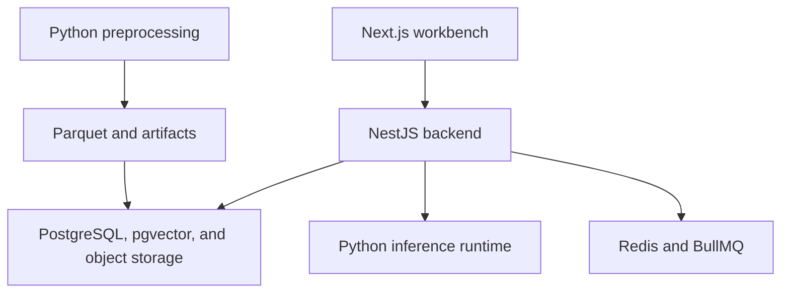
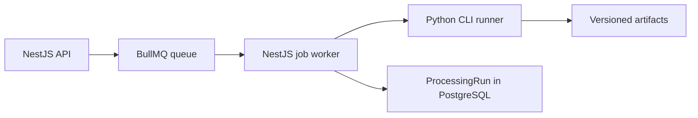
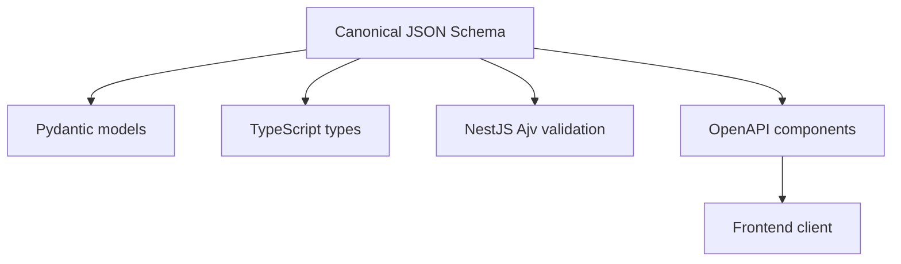

# Technology Stack — AIC HCMC 2026

**Status:** Accepted baseline with explicitly provisional choices  
**Version:** 1.1  
**Last updated:** 2026-07-17  
**Language:** English  
**Vietnamese version:** [`tech_stack.vi.md`](tech_stack.vi.md)  
**Related documents:** [`PRD.md`](../../PRD.md), [`implementation_plan.md`](../../implementation_plan.md)

> **Primary decision**  
> Python owns preprocessing, feature extraction, and model inference. NestJS is the primary backend and owns APIs, business logic, retrieval orchestration, task executors, sessions, and the competition adapter.

## 1. Technology stack overview



| Layer | Primary technology | Responsibility |
|---|---|---|
| Preprocessing/ML | Python 3.11+, PyTorch, FFmpeg, PyAV, OpenCV | Decode, segmentation, sampling, and evidence extraction |
| Data processing | Polars, PyArrow, Pydantic | Tabular processing, Parquet, and contract validation |
| Backend | Node.js LTS, TypeScript, NestJS | APIs, orchestration, retrieval, executors, and adapters |
| ORM/database | PostgreSQL, pgvector, Prisma candidate | Catalog, metadata, vectors, sessions, and processing state; Prisma remains conditional on the P0 spike |
| Lexical search | PostgreSQL FTS and `pg_trgm` | OCR, ASR, and caption search |
| Queue/cache | Redis and BullMQ | Long-running jobs, retries, rate limits, cache, and distributed locks |
| Object storage | MinIO or local filesystem | Video, proxy, keyframes, Parquet, model artifacts, and reports |
| Frontend | Next.js, React, TypeScript | Operator workbench |
| UI/data client | TanStack Query, Zustand, generated OpenAPI client | Server state, UI state, and typed APIs |
| Media delivery | Nginx | HTTP Range, caching, and media proxying |
| Contracts | JSON Schema, OpenAPI, Pydantic, TypeScript types | Stable communication between Python, NestJS, and the frontend |
| Observability | OpenTelemetry, Prometheus, Grafana, Pino | Traces, metrics, dashboards, and structured logs |
| Deployment | Docker Compose, NVIDIA Container Toolkit | Local/offline execution and GPU profiles |
| Testing | Pytest, Jest/Vitest, Playwright, Testcontainers | Unit, contract, integration, and end-to-end tests |

### Recommended version policy

Patch versions are not fixed in this document. Exact versions must be pinned in lockfiles and container image digests.

| Technology | Version policy |
|---|---|
| Python | `>=3.11,<3.13` until the complete ML dependency set supports Python 3.13 |
| Node.js | A team-validated LTS release pinned in `.nvmrc` and the container image |
| NestJS | The stable major release selected at project initialization and pinned by the lockfile |
| PostgreSQL | A supported major release with the `vector` and `pg_trgm` extensions |
| CUDA/PyTorch | Selected for the target GPU and pinned by container image digest |

## 2. Component architecture

### 2.1 Python preprocessing

Python owns all work that depends on media, audio, or ML libraries:

- manifest ingestion, checksums, and metadata probing;
- PTS and timestamp normalization;
- shot detection and the temporal hierarchy;
- adaptive keyframe sampling;
- quality scoring and duplicate clustering;
- visual and clip embeddings;
- OCR and temporal OCR tracks;
- VAD, ASR, and word alignment;
- captions, object detection, audio embeddings, and SED when enabled;
- evidence mapping, validation, and artifact publication.

| Need | Library/tool |
|---|---|
| Media probing and transcoding | FFmpeg and `ffprobe` |
| PTS-aware decoding | PyAV |
| Image/video processing | OpenCV and Pillow |
| Tensor/model runtime | PyTorch, Transformers, and ONNX Runtime where appropriate |
| DataFrames | Polars |
| Columnar artifacts | PyArrow and Parquet |
| Schema/runtime validation | Pydantic v2 and `jsonschema` |
| CLI | Typer |
| Configuration | Pydantic Settings; Hydra/OmegaConf only when experiments require it |
| Testing | Pytest, Hypothesis, and pytest-cov |
| Code quality | Ruff and mypy or pyright |

Every pipeline stage must follow this flow:

```text
typed input
  → deterministic processing
  → typed output
  → artifact manifest
  → validation report
```

A pipeline stage must not write directly to an active index. It publishes immutable artifacts under:

```text
artifacts/pipeline_runs/<dataset_id>/<pipeline_version>/
```

Only validated artifacts may be ingested into PostgreSQL and pgvector.

### 2.2 NestJS backend

NestJS is the only backend directly accessed by the frontend or competition integration. It owns:

- REST APIs and OpenAPI generation;
- internal authentication and authorization;
- dataset, job, and index lifecycles;
- artifact-validation coordination and ingestion status;
- structured query planning;
- parallel retrieval-branch orchestration;
- RRF, temporal grouping, and diversity;
- KIS, AVS, VQA, and KISC task executors;
- confidence, fallback, and degraded-response behavior;
- sessions, feedback, and operator state;
- media metadata and signed or range-capable URLs;
- the competition adapter and submission preview;
- audit logs, rate limits, health checks, and metrics.

Recommended structure:

```text
apps/backend/
├── src/
│   ├── main.ts
│   ├── app.module.ts
│   ├── common/
│   │   ├── config/
│   │   ├── errors/
│   │   ├── guards/
│   │   ├── interceptors/
│   │   ├── logging/
│   │   └── versioning/
│   ├── database/
│   ├── datasets/
│   ├── jobs/
│   ├── indexes/
│   ├── ingestion/
│   ├── planner/
│   ├── retrieval/
│   │   ├── branches/
│   │   ├── fusion/
│   │   ├── grouping/
│   │   ├── confidence/
│   │   └── resilience/
│   ├── executors/
│   │   ├── textual-kis/
│   │   ├── video-kis/
│   │   ├── avs/
│   │   ├── vqa/
│   │   └── kisc/
│   ├── evidence/
│   ├── sessions/
│   ├── media/
│   ├── competition/
│   └── health/
├── prisma/                  # created only if the Prisma spike passes
│   ├── schema.prisma
│   └── migrations/
├── test/
└── package.json
```

Recommended NestJS packages and integrations:

| Concern | Package/integration |
|---|---|
| Configuration | `@nestjs/config` |
| OpenAPI UI | `@nestjs/swagger` serves the assembled contract; it is not the canonical schema generator |
| Contract validation | Ajv against canonical JSON Schemas; `class-validator` is limited to non-contract internal forms if needed |
| Queue | `@nestjs/bullmq` and BullMQ |
| Health | `@nestjs/terminus` |
| Logging | `nestjs-pino` and Pino |
| Database | Database adapter; provisional Prisma Client plus parameterized raw SQL only if its spike passes |
| Metrics/tracing | OpenTelemetry and a Prometheus client |
| API tests | Supertest |

### 2.3 Online model inference

NestJS must not import or execute PyTorch models directly. Two runtime strategies are available:

| Strategy | Use when | Decision |
|---|---|---|
| Python inference runtime | PyTorch/Transformers models, GPU execution, rerankers, or frequently changed models | **Recommended baseline** |
| ONNX Runtime in Node.js | Small models with stable exports and benchmarked output parity | P1 optimization after measurement |

The Python inference runtime belongs under the existing `apps/` boundary:

```text
apps/inference/
├── src/
│   ├── api/
│   ├── encoders/
│   ├── rerankers/
│   ├── model_registry/
│   └── health/
├── tests/
└── pyproject.toml
```

This runtime provides only online inference that cannot be precomputed, such as:

- text-query encoding for SigLIP or CLIP;
- query audio/video encoding when a task requires it;
- top-K cross-encoder or VLM reranking;
- VQA answer generation from an evidence bundle when enabled.

Dataset-wide OCR, ASR, object detection, captions, and embeddings remain offline work under `pipelines/`. NestJS communicates with the inference runtime over internal HTTP in P0. gRPC is introduced only if profiling proves that serialization or throughput is a bottleneck.

Every inference request must carry:

- `request_id`;
- `model_family` and `model_revision`;
- an explicit deadline;
- a versioned input contract;
- output dimension and dtype where applicable;
- one of `completed`, `timed_out`, `unavailable`, or `failed`;
- circuit-breaker protection in NestJS.

### 2.4 Database and search

PostgreSQL is the canonical source for metadata and operational state. pgvector provides the baseline vector search implementation.

| Data | Technology |
|---|---|
| Dataset, video, and temporal nodes | PostgreSQL relational tables |
| OCR/ASR/caption lexical search | PostgreSQL FTS, `pg_trgm`, and normalized/no-diacritic columns |
| Visual, clip, and audio embeddings | pgvector |
| Sessions, feedback, and submission previews | PostgreSQL |
| Job state, idempotency, and deduplication | PostgreSQL; Redis only for short-lived locks or cache |
| Artifacts, video, and keyframes | MinIO or filesystem; the database stores URI and checksum only |

Prisma is the provisional ORM and migration candidate. It becomes final only after the P0 spike validates pgvector columns and indexes, parameterized similarity queries, transaction behavior, and forward/rollback migrations. Until that gate passes, no application module may depend on Prisma-specific behavior outside the database adapter. Controlled raw SQL must remain behind repository interfaces, use parameter binding, and have integration tests.

Qdrant and OpenSearch are excluded from P0. They may be added only if benchmarks show that PostgreSQL cannot meet measured latency, recall, or scale requirements.

### 2.5 Queues and job orchestration

BullMQ is consumed only by Node.js workers. A Python process must never read BullMQ's Redis structures directly. The P0 execution path is:



| Work type | Execution model |
|---|---|
| Dataset preprocessing | A NestJS BullMQ worker launches the version-pinned Python CLI, sharded by `video_id` |
| API-triggered job | NestJS creates a durable `ProcessingRun`, commits it, and enqueues only its stable `run_id` |
| Python execution | The NestJS worker invokes a Python command through a typed runner adapter; Python never consumes BullMQ directly |
| Progress | Python emits newline-delimited JSON events; the NestJS worker validates and persists bounded progress updates |
| Cancellation | NestJS sets `cancel_requested`, sends `SIGTERM`, waits for a configured grace period, then uses `SIGKILL` only for the owned child process |
| Completion | The worker validates the artifact manifest and checksums before marking the run successful |
| Index activation | Separate job: build → validate → smoke test → atomic activation; failure retains the previous active index |
| Live query | Never routed through a queue; executes within the request latency budget |
| Slow reranking or VQA | Optional asynchronous path or a separate latency budget |

The job payload contains only stable identifiers and execution controls: `run_id`, `dataset_id`, `stage`, `video_ids` or shard reference, `config_uri`, `expected_versions`, `attempt`, and `deadline_ms`. Secrets and large media payloads are never embedded in Redis.

The runner adapter must use an argument array rather than a shell string, set an explicit working directory and allow-listed environment, capture bounded stdout/stderr, propagate trace IDs, and reject paths outside configured roots. Python returns process exit status plus a final typed event containing artifact-manifest URI and checksum.

BullMQ provides bounded retries, exponential backoff, delayed jobs, and concurrency control. PostgreSQL remains the canonical state store. Redis is coordination infrastructure and must never be the only durable source of job state. A later HTTP-based Python worker is allowed only behind the same runner contract and after a benchmark or deployment need is recorded.

### 2.6 Frontend

The frontend uses Next.js, React, and TypeScript:

- TanStack Query for server state, caching, and request cancellation;
- Zustand for selection, player, and session UI state;
- a generated OpenAPI client for NestJS contract parity;
- Tailwind CSS or CSS Modules, selected consistently by the team;
- an HTML5-based player with precise seek and Range-request support;
- Playwright for operator end-to-end workflows;
- Vitest and Testing Library for component and unit tests.

The frontend never accesses PostgreSQL, Redis, MinIO, or the Python inference runtime directly.

## 3. Contracts, operations, and implementation decisions

### 3.1 Python–NestJS contracts

JSON Schema under `contracts/schemas/` is the shared source of truth. Contract DTOs are not maintained by hand.



Pinned toolchain:

- `datamodel-code-generator` generates Pydantic v2 models for Python;
- `json-schema-to-typescript` generates shared TypeScript contract types;
- Ajv validates request, response, job-event, and artifact envelopes in NestJS;
- a repository build script assembles OpenAPI 3.1 paths plus canonical component `$ref`s into `docs/api/internal-v1.json`;
- Redocly CLI or an equivalent pinned validator lints the assembled OpenAPI document;
- `openapi-typescript` generates the frontend API types/client boundary.

Rules:

- Do not maintain multiple handwritten definitions of one payload.
- Generated files are read-only build outputs and carry the source schema hash.
- CI validates valid and invalid examples in both Python and TypeScript.
- CI regenerates Pydantic, TypeScript, OpenAPI, and frontend outputs and fails on a dirty diff.
- Timestamps are integer milliseconds with `[start_ms, end_ms)` semantics.
- Missing scalars are `null`; missing collections are `[]`.
- Every artifact and online response identifies dataset, pipeline, schema, and index versions.
- Breaking changes require a new schema major version and migration notes.

### 3.2 API style

- REST and JSON are the P0 internal public protocol.
- The contract build assembles OpenAPI 3.1 at `docs/api/internal-v1.json`; NestJS serves that committed document.
- Large collections use cursor pagination.
- Every response includes `request_id`.
- Job creation, index activation, and submission use idempotency keys.
- A global validation pipeline rejects invalid or unknown fields explicitly.
- Each retrieval and inference branch has a timeout, circuit breaker, and bulkhead.
- Errors include `code`, `message`, `recoverable`, sanitized `details`, and `request_id`.

### 3.3 Observability

| Component | Technology |
|---|---|
| NestJS logging | Pino JSON |
| Python logging | `structlog` or standard JSON logging |
| Distributed tracing | OpenTelemetry |
| Metrics | Prometheus client libraries |
| Dashboards | Grafana |
| Error tracking | Self-hosted Sentry or disabled in safe mode |

Traces must connect the complete request path:

```text
frontend request
  → NestJS query plan
  → retrieval branches
  → Python inference when required
  → fusion and task executor
  → response
```

Logs must not contain secrets, full sensitive transcripts, or organizer credentials.

### 3.4 Testing stack

| Scope | Tooling |
|---|---|
| Python unit/property tests | Pytest and Hypothesis |
| Python pipeline/golden tests | Pytest with media fixtures |
| NestJS unit tests | Jest or Vitest |
| NestJS integration tests | Supertest and Testcontainers |
| Contracts | JSON Schema validators in Python and TypeScript |
| Database and migrations | Testcontainers PostgreSQL with pgvector |
| Frontend unit tests | Vitest and Testing Library |
| Operator E2E | Playwright |
| Load testing | k6 |
| Failure and timeout testing | Toxiproxy or controlled test doubles |

### 3.5 Deployment profiles

The P0 Docker Compose deployment contains:

```text
frontend
backend-nestjs
inference-python
preprocessing-worker-python
postgres-pgvector
redis
minio
nginx
prometheus
grafana
```

The `aic2026-safe` profile enforces:

- external network disabled;
- models and tokenizers cached locally;
- secrets injected through environment or mounted files, never committed;
- read-only source media;
- separate artifact and index volumes;
- GPU access only for Python workers and inference;
- live submission disabled by default;
- PostgreSQL, object-storage, and active-version snapshots before competition use.

### 3.6 Confirmed and provisional decisions

| Decision | Selection | Status/gate |
|---|---|---|
| Preprocessing language | Python | Confirmed |
| Backend API and orchestration | NestJS and TypeScript | Confirmed |
| Heavy online ML | Python inference runtime called by NestJS over an internal API | Confirmed boundary; framework remains open |
| Frontend | Next.js, React, and TypeScript | Confirmed |
| Database | PostgreSQL and pgvector | Confirmed |
| ORM/migrations | Prisma candidate | Provisional until the pgvector/migration spike passes |
| Lexical search | PostgreSQL FTS and `pg_trgm` | Confirmed P0 baseline |
| Queue/cache | Redis and BullMQ, consumed by NestJS workers only | Confirmed P0 baseline |
| Python batch execution | NestJS runner launches a version-pinned Python CLI | Confirmed P0 baseline |
| Artifact storage | Filesystem for small dev; MinIO for multi-container profiles | Confirmed profile policy |
| Media delivery | Nginx HTTP Range | Confirmed |
| Contracts | Canonical JSON Schema; generated Pydantic/TypeScript; Ajv; assembled OpenAPI 3.1 | Confirmed toolchain |
| Baseline deployment | Docker Compose, local-first | Confirmed |

### 3.7 Open decisions

1. Prisma acceptance: run the pgvector/migration spike; if it fails, evaluate MikroORM or a thin SQL repository without changing domain contracts.
2. Python inference framework and HTTP versus gRPC: start with a minimal internal HTTP adapter and change only after profiling.
3. Jest versus Vitest for NestJS: select one backend-wide standard.
4. Monorepo package manager: pnpm is recommended for `apps/backend` and `apps/frontend`.
5. Models eligible for ONNX in Node.js: decide only after output-parity and latency benchmarks.
6. Qdrant or OpenSearch: excluded from P0; reconsider after benchmarking the real dataset.

### 3.8 First implementation steps

1. Initialize NestJS under `apps/backend/` with configuration, health checks, Pino, and OpenAPI.
2. Run the Prisma pgvector/migration spike; adopt Prisma only if the documented gate passes.
3. Freeze `VersionManifest`, `Segment`, `EvidenceRecord`, `QueryPlan`, `BranchResult`, and `SearchResponse`; implement the pinned schema-generation pipeline.
4. Build a Python CLI that processes the golden fixture and publishes Parquet plus manifests.
5. Build the NestJS BullMQ worker and typed Python CLI runner, then ingest validated artifacts into PostgreSQL.
6. Add a visual retrieval branch stub and a Python query-encoder endpoint.
7. Use RRF in NestJS to combine visual, OCR, and ASR fixture results.
8. Generate the Next.js OpenAPI client and complete the search-to-play vertical slice.

---

**Conclusion:** Python concentrates media and ML concerns; NestJS concentrates APIs, data access, and orchestration. JSON Schema and OpenAPI keep the two ecosystems synchronized, while the Python inference runtime prevents NestJS from directly operating heavyweight PyTorch models.
